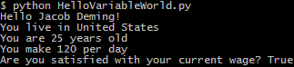
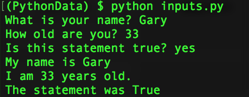
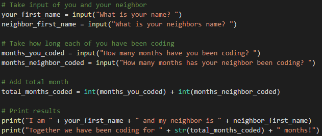
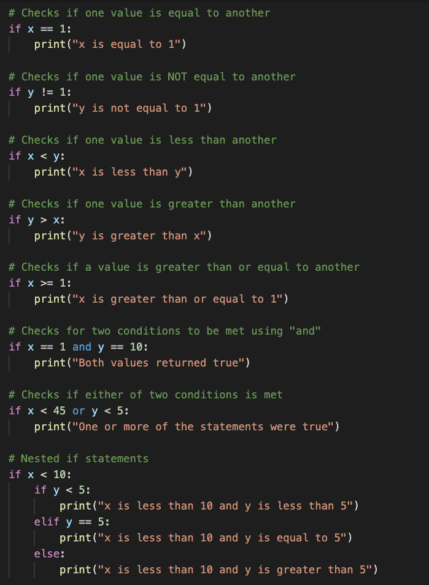
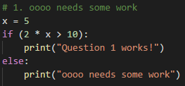
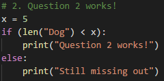
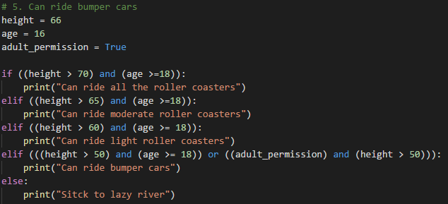

## 3.1 Lesson Plan: Introduction to Python

---

### Overview

In today's class, students will transition from VBA to the Python programming language. To start, we’ll check the Python installation for students; then, we’ll cover the basics of terminal navigation, variables, conditionals, and loops.

### Class Objectives

By the end of this lesson, the students will be able to:

* Perform their Python 3 installation.

* Navigate through files and folders via the terminal.

* Create Python scripts and run them in the terminal.

* Understand basic programming concepts in Python.

### Instructor Notes

In this module, we introduce Anaconda environments. This curriculum has been tested with Python 3.10, but updates to packages and variances in student machines can still cause conflicts to occur. If a student has an error that you believe to be related to Python 3.10, at your discretion you can instruct them to create a new environment using a different Python version. If you believe that an update has introduced a bug at a curriculum level, attempt to find a suitable workaround for the moment and submit a report using the Boot Camp Feedback Form.

* Students should have installed Anaconda before class. Today, the students will be using Python from their Anaconda installation. Take a moment to ensure that everyone has installed Anaconda. After a brief tutorial on using Git Bash and Mac terminal, the students will be creating the virtual environment that will be used with Jupyter Notebook and Pandas next week.

* Students may find themselves frustrated by some of the quirks that Git Bash and terminal, and Python. It’s important that you maintain a positive tone and are prepared to help the class fix whatever bugs they encounter.

* Try to identify confused students who may be reluctant to raise their hands and ask for assistance. Have the TAs circulate during the sections of the lesson that deal with console commands, especially as very few students will have ever worked with a computer this way. Also, regularly encourage the class to ask questions whenever they are confused, and reassure them that confusion is simply part of the learning process.

---

### Class Slides

* The slides for this lesson can be viewed on Google Drive here: [Lesson Slides](https://docs.google.com/presentation/d/1dd31Qpb8ksD2tUfeQT4b9qr44Vz-EB8ZbPl5ACwQoRQ/edit?usp=sharing).

* To add the slides to the student-facing repository, download the slides as a PDF by navigating to File, selecting "Download as," and then choosing "PDF document." Then, add the PDF file to your class repository along with other necessary files. You can view instructions for this [here](https://docs.google.com/document/d/1XM90c4s9XjwZHjdUlwEMcv2iXcO_yRGx5p2iLZ3BGNI/edit?usp=sharing).

* **Note:** Editing access is not available for this document. If you wish to modify the slides, create a copy by navigating to File and selecting "Make a copy...".

---

### Time Tracker

| Start Time | Number | Activity                                           | Duration |
| ---------- | ------ | -------------------------------------------------- | -------- |
| 6:30 PM    | 1      | Instructor Do: Intro to Python                     | 0:05     |
| 6:35 PM    | 2      | Instructor Do: Terminal                            | 0:10     |
| 6:45 PM    | 3      | Students Do: Terminal                              | 0:10     |
| 6:55 PM    | 4      | Review: Terminal                                   | 0:05     |
| 7:00 PM    | 5      | Everyone Do: Check Your Anaconda Installation      | 0:05     |
| 7:05 PM    | 6      | Everyone Do: Create a Virtual Environment          | 0:10     |
| 7:15 PM    | 7      | Instructor Do: Variables                           | 0:05     |
| 7:20 PM    | 8      | Students Do: Hello, Variable World!                | 0:10     |
| 7:30 PM    | 9      | Review: Hello, Variable World                      | 0:05     |
| 7:35 PM    | 10     | Instructor Do: Inputs and Prompts                  | 0:05     |
| 7:40 PM    | 11     | Students Do: Down to Input                         | 0:10     |
| 7:50 PM    | 12     | Review: Down to Input                              | 0:05     |
| 7:55 PM    | 13     | Instructor Do: Conditionals                        | 0:05     |
| 8:00 PM    | 14     | Students Do: Conditional Conundrum                 | 0:10     |
| 8:10 PM    | 15     | Review: Conditionals Conundrum                     | 0:05     |
| 8:15 PM    | 16     | BREAK                                              | 0:15     |
| 8:30 PM    | 17     | Instructor Do: Lists                               | 0:10     |
| 8:40 PM    | 18     | Students Do: Rock, Paper, Scissors                 | 0:15     |
| 8:55 PM    | 19     | Review: Rock, Paper, Scissors                      | 0:05     |
| 9:00 PM    | 20     | Instructor Do: Loops                               | 0:10     |
| 9:10 PM    | 21     | Students Do: Number Chain - Loops                  | 0:15     |
| 9:25 PM    | 22     | Review: Number Chain                               | 0:05     |
| 9:30 PM    |        | END                                                |          |

---

### 1. Instructor Do: Intro to Python (5 min)

Open the slideshow and use the first few slides to facilitate your welcome to the class. Cover the following points:

* Welcome students, and explain that we will now proceed to a more traditional programming language, Python, which we’ll be working with for the next several weeks.

* Explain to students that the most significant change from Visual Basic will be the syntax; the fundamental concepts are the same.

---

### 2. Instructor Do: Terminal (10 min)

**Corresponding Activity:** [01-Ins_Terminal](Activities/02-Stu_TerminalTest/)

Continue using the slideshow to accompany this demonstration.

Explain that all Python code will be executed through either Git Bash or the Mac Terminal. Windows users should always use Git Bash, and Mac users should use the Terminal.

Send out [CommonCommands.txt](Activities/01-Ins_Terminal/Solved/common_commands_solution.txt) for the students to use as a reference.

Open up the terminal or Git Bash, and guide students through the following commands:

* `cd` changes the directory.

* `cd ~` changes to the home directory.

* `cd ..` moves up one directory.

* `ls` lists files in the folder.

* `pwd` shows the current directory.

* `mkdir <FOLDERNAME>` creates a new directory with the FOLDERNAME.

* `touch <FILENAME>` creates a new file with the FILENAME.

* `rm <FILENAME>` deletes a file.

* `rm -r <FOLDERNAME>` deletes a folder; note the “-r” to students.

* `open .` opens the current folder on Macs.

* `explorer .` opens the current folder on Windows.

* `open <FILENAME>` opens a specific file on Macs.

* `explorer <FILENAME>` opens a specific file on Windows.

* The following image captures a demonstration of the listed commands.
.

Take a moment to answer any questions before proceeding.

Now that you have demonstrated basic terminal navigation, guide students through editing Python files and running them in the terminal.

* Create and navigate into a `PythonStuff` folder on the desktop.

* Create and open `first_file.py` using the text editor.

* Add `print("This is my first Python file")`, and save the code.

* Return to the terminal, and run the file using `python first_file.py`.

* Explain that `python <FILENAME>.py` tells the computer that this is a Python file and to run the code.

* The following image captures these commands in the terminal:


* Repeat the process with `second_file.py`, using the code `print("This is my second python file")`.

---

### 3. Students Do: Terminal (10 min)

**Corresponding Activity:** [02-Stu_TerminalTest](Activities/02-Stu_TerminalTest/)

Now, students will do some work in the terminal. They’ll create three folders and a pair of Python files to print strings of their own creation to the console.

After answering any questions that students have about the activity, send out the instructions.

Open the slideshow, and use the next slides as an accompaniment to the activity.

---

### 4. Review: Terminal (5 min)

**Corresponding Activity:** [02-Stu_TerminalTest](Activities/02-Stu_TerminalTest/)

Open and send out the solution, then work through the solution code in the terminal while displaying the results on the computer.

* Cover the following key points during your review of this activity:

  * `mkdir` will make the directories.

  * `cd` changes into directories.

  * `touch` will create the file. It will be empty.

  * To add lines of code to these files, simply edit them in a text editor.

  * Then, we can run the code using `python quick_python.py`. Remind students using Macs to run the `which python` command, which will allow them to check that they are using Anaconda's Python (3.7+) instead of the default Mac version (2.7).

  * `cd ..` will take you back **one** level to the `LearnPython` folder, where the process can be repeated.

  * `cd ../..` will take you back **two** levels.

  * Demonstrate and discuss the benefit of using the tab key for autocompletion while typing the path to a directory or running a file.

  * Demonstrate and discuss the benefits of using the _up_ and _down_ arrow keys instead of repeatedly typing commands or using the tab key.

  * Finally, guide students through the process of retrieving their command history by typing `history` on the command line.

---

### 5. Everyone Do: Check Your Anaconda Installation (5 min)

Open the slideshow, and use the next slides for this activity.

Quickly check that students have `conda` installed and added to their path.

Open up the console, and have students follow along.

* Enable the terminal commands by following the instructions for your operating system.
    * **Windows:** In your terminal, run the command `conda init bash`. Then close your terminal, and start a new one.
    * **Mac:** If you're running an OS version earlier than 10.15 OR running version 10.15 with a `bash` terminal environment, type `conda init bash`. If you're running versions 10.15 (Catalina) or later AND running the `zsh` environment, type `conda init zsh`. Then close your terminal and start a new one.

* Enter `conda --version`, which will display the version of Anaconda installed, as in the following image:

  

Have TAs help any students who are experiencing difficulty. The most common problem will likely be that some students have not run `conda init bash` and/or restarted their terminal.

* For students on Windows, the PATH needs to be added to Windows' environment variables. The easiest solution here is to uninstall/reinstall Anaconda and make sure to check the "Install to Path" box that comes up in a menu.

---

### 6. Everyone Do: Create a Virtual Environment (10 min)

Continue stepping through the slideshow as an accompaniment to this activity.

Next, proceed to an explanation of [managing virtual environments](https://conda.io/docs/user-guide/tasks/manage-environments.html).

* Virtual environments create an isolated environment for Python projects.

* Explain how different projects can have different dependencies.

* Explain how different projects might also use different types and versions of libraries.

* This virtual environment will make sure that everyone has all the right dependencies for future class activities.

Sharing the following analogy may be useful if some students are still confused:

* Imagine you had exactly one flat surface in your entire home. You used it for cooking, homework, sleeping, hobbies, and anything else that required a flat surface.

* That surface would become incredibly cluttered, and tools for one task may accidentally be used for another task. For example, a knife used for your wood carving hobby may get accidentally get used to slice your vegetables.

* Creating a virtual environment is the similar to adding another flat surface in your home - this way tasks and tools can be installed, organized, and modified specifically for one use without affecting tools used for other things.

Walk the class through creating the `dev` virtual environment that will run Python 3.10. This will help solve issues where students have multiple versions of Python installed.

* First, update the conda base environment:

  ```
  conda deactivate
  conda update conda
  conda update anaconda
  conda update -n base -c defaults conda
  ```

  * Have students type `y` whenever prompted to proceed.

* Next, create a new environment called `dev` using Python 3.10 with the default packages from Anaconda:

  ```
  conda create -n dev python=3.10 anaconda -y
  ```

* Have students activate their environment:

  ```
  conda activate dev
  ```

* Finally, explain that you can exit the environment by entering `conda deactivate`.

Tell students that they will need to activate their environment each time they open a new terminal. Windows users should always use `git-bash` for their terminal.

---

### 7. Instructor Do: Variables (5 min)

**Corresponding Activity:** [03-Ins_Variables](Activities/03-Ins_Variables/)

Continue through the slideshow, using the next few slides to facilitate a discussion about variables.

Open and share the solution file and explain to students that variables let us store information that we can use later.

* Remind students how VBA accessed certain values when they referred to a specific cell. This is essentially what a variable does in Python&mdash;it stores a value.

Guide students through the code, and explain the following points:

* Variables can store different data types, like strings, integers, and an entirely new data type called Booleans, which hold `True` or `False` values.

  ```python
  ## Creates a variable with a string "Frankfurter"
  title = "Frankfurter"

  ## Creates a variable with an integer 80
  years = 80

  ## Creates a variable with the boolean value of True
  expert_status = True
  ```

* We can print statements that include variables, but traditional Python formatting won't concatenate strings with other data types. This means integers and Booleans must be cast as strings using the `str()` function.

  ```python
  ## Prints a statement adding the variable
  print("Nick is a professional " + title)

  ## Convert the integer years into a string and prints
  print("He has been coding for " + str(years) + " years")

  ## Converts a boolean into a string and prints
  print("Expert status: " + str(expert_status))
  ```

* Alternatively, the **f-string** method of string interpolation allows strings to be formatted with different data types. Demonstrate the differences by refactoring the last print statement as an f-string:

  ```python
  ## An f-string accepts all data types without conversion
  print(f"Expert status: {expert_status}")
  ```

Send out the following reference guide for [Python 3's f-Strings](https://realpython.com/python-f-strings/).

Answer any questions that students may have before moving on to the next activity.

---

### 8. Students Do: Hello, Variable World! (10 min)

**Corresponding Activity:** [04-Stu_HelloVariableWorld](Activities/04-Stu_HelloVariableWorld/)

Continue through the slideshow, using the next slides as an accompaniment to this activity.

Now it’s time to create a simple Python application that uses variables. The application will run calculations on integers and print strings out to the console.

Open up the solution file within the command line, and run and discuss the code to give students an idea of how the application should function, as captured in the following image:



Then, send out the instructions from the README file.

---

### 9. Review: Hello, Variable World (5 min)

**Corresponding Activity:** [04-Stu_HelloVariableWorld](Activities/04-Stu_HelloVariableWorld/)

Open the solution, share the file with the students, and go over the code line by line with the class, answering whatever questions students may have.

Cover the following key points during the discussion:

* Each variable has to be declared individually but does not have to be cast at declaration. Python figures out the data type on its own.

* Integer variables can be placed into calculations by using their name.

* Even though Booleans look like strings, they do not use quotations in their declaration, as in the following image:

  

* When traditionally printing out integers and Booleans with strings, the variables must also be cast as strings. Without casting them as strings, the console will return an error.

```python
## Print out the user's age
print("You are " + str(age) + " years old")
```

* When using an f-string, integers and Booleans do not need to be cast as strings. Also, the syntax is slightly different: variables are enclosed in curly braces, there are no plus signs, and there is a single set of quotation marks around the entire string.

```python
## With an f-string, print out the daily wage that was calculated
print(f"You make {daily_wage} per day")

## With an f-string, print out whether the users were satisfied
print(f"Are you satisfied with your current wage? {satisfied}")
```

---

### 10. Instructor Do: Inputs and Prompts (5 min)

**Corresponding Activity:** [05-Ins_Prompts](Activities/05-Ins_Prompts/)

Continue through the slideshow to facilitate discussion of the next topic.

Open solution file, then run the code within the terminal before opening the code in the text editor, as in the following image:



Next, explain how the code completes the following actions:

* It takes input from the command line after printing a prompt to the terminal.

* The variable `name` will store the user's response to the prompt.

* Every response to an input is stored as a string regardless of the characters entered. Therefore, variables that are intended as integers must be cast as integers to be used in calculations.

* The `bool()` function always returns `True` if any text is inside of it; technically, any nonempty string will evaluate to `True`.

* Print statements can be concatenated with variables as long as they are also strings or are cast as strings.

  ```python
  ## Collects the user's input for the prompt "What is your name?"
  name = input("What is your name? ")

  ## Collects the user's input for the prompt "How old are you?"
  ## and converts the string to an integer.
  age = int(input("How old are you? "))

  ## Collects the user's input for the prompt "Is input truthy?"
  ## and converts it to a boolean.
  ## Note that non-zero, non-empty objects are truth-y.
  trueOrFalse = bool(input("Is the input truthy? "))

  ## Creates three print statements that respond with the output.
  print("My name is " + str(name))
  print("I will be " + str(age + 1) + " next year.")
  print("The input was converted to " + str(trueOrFalse))
  ```

---

### 11. Students Do: Down to Input (10 min)

**Corresponding Activity:** [06-Stu_DownToInput](Activities/06-Stu_DownToInput/)

Continue through the slideshow, using the next slides as an accompaniment to this activity.

This activity will give students a chance to work on storing inputs from the command line and running code based on the values entered.

Open up the solution file within the command line, run the code, and discuss with students how the application should function. The following image captures the code:


Then, send out the instructions from the README file.

---

### 12 Review: Down to Input (5 min)

**Corresponding Activity:** [06-Stu_DownToInput](Activities/06-Stu_DownToInput/)

Open the solution, send out the file, and go over the code line by line with the class, answering whatever questions students may have.

Cover the following key points in your discussion:

* We set the variables `your_first_name` and `neighbor_first_name` using two inputs; since they are strings, they will not need to be cast later on.

* The `months_you_coded` and `months_neighbor_coded` are set using two more inputs. They have to be added together, so they will need to be cast as integers later on.

* After calculating the total number of months, this new integer variable will have to be cast as a string to be printed, as in the following image:

  

---

### 13. Instructor Do: Conditionals (5 min)

**Corresponding Activity:** [07-Ins_Conditionals](Activities/07-Ins_Conditionals/)

Continue the slideshow to facilitate discussion of the next topic.

Open solution in a text editor and review the code with the class.

Students should be familiar with conditionals from their time with VBA. Explain that the logic in Python is nearly the same; the primary differences are the syntax and indentation.

* Python uses `if`, `elif`, and `else` to create conditionals. Emphasize that we should always pay attention to the letter case and spelling.

* Conditional statements are concluded with a colon. Because Python reads blocks of code based on indentation, all lines after the colon **must** be indented to be considered a part of that code block, as in the following image:

  

* All sorts of operators, including greater than, less than, and equal to, can be used to create logic tests for conditionals.

* The condition `is equal to` uses `==`, while variable assignment uses one equal sign.

* Multiple logic tests can be checked within a single conditional statement. If we use the term `and`, both tests must return `True`, while `or` requires that only one test return as true.

* Conditionals can even be nested, allowing programmers to perform logic tests based on whether or not the original logic test returned as `True`, as in the following image:

  

Answer any questions that the class may have before sending out the code for students to reference during the next exercise.

---

### 14. Students Do: Conditional Conundrum (10 min)

**Corresponding Activity:** [08-Stu_ConditionalConundrum](Activities/08-Stu_ConditionalConundrum/)

Continue through the slideshow, using the next slides as an accompaniment to this activity.

During this activity, students will review pre-written conditionals and predict the lines that will be printed to the console.

Send out the instructions from the README file.

---

### 15. Review: Conditionals Conundrum (5 min)

**Corresponding Activity:** [08-Stu_ConditionalConundrum](Activities/08-Stu_ConditionalConundrum/)

Open up the solution file, share the file, and go over the code line by line with the class, answering whatever questions students may have.

Cover the following key points during your discussion:

* The `if` statement for the first chunk of code, captured in the following image, checks whether `10 > 10`, which is false. Therefore, the code returns "ooo needs some work", as captured in the following image:

  

* In the second chunk of code, captured in the following image, the length of "Dog" is 3 and `x` is 5; thus, the statement for the second chunk of code is true, and the code will return "Question 2 works!", as captured in the following image:

  

* The addition of the `and` statement to the third chunk of code, captured in the following image, means that both logic tests need to return `True` to run. Thankfully, both do, so "GOT QUESTION 3!" is printed, as captured in the following image:

  

* Conditionals work line by line. The logic tests in chunk four, captured in the following image, do not return as `True` until the third conditional; therefore, "Dan is in group three" is printed, as captured in the following image:

  

* Within chunk five, captured in the following image, one of the conditions is met in the third conditional, but it's not until getting into the `or` statement of the fourth conditional that the logic test finally returns as `True`, as captured in the following image:

  

Ask the class if anyone would like to share their creations from the bonus section of the activity.

* Have students slack out their code and explain how their conditional puzzles worked with the class.

---

### 16. BREAK (15 min)

---

### 17. Instructor Do: Lists (10 min)

**Corresponding Activity:** [09-Ins_List](Activities/09-Ins_List/)

Continue the slideshow to facilitate discussion of the next topic.

Welcome students back from break, and let them know that **lists** are the next data type that we’ll be covering.

* Lists are the Python equivalent of arrays in VBA. Like arrays, lists hold multiple pieces of data within one variable.

* Lists can hold multiple types of data, such as strings, integers, and Boolean values&mdash;all can be stored within a single list!

Open and share the solution file, then explain how to create a list, called `myList`, with a mix of data types:

* The `append` method can add elements to the end of a list.

* The `index` method returns the numeric location of a given value within a list.

* The `len` function returns the length of a list.

* The `remove` method deletes a given value from a list.

* The `pop` method can be used to remove a value by index.

  * Remind students that indexing in lists starts at `0`.

* The following image captures the code for this demonstration.


Python also has a data type called "tuples," which are functionally similar to lists in what they can store&mdash;but they are immutable.

* Although lists in Python can be modified after their creation, tuples can never be modified after their declaration.

* Tuples tend to be more efficient to navigate through than lists; they also protect the data stored within from being changed.

* For more info on tuples, have your students check out this [quora question](https://www.quora.com/What-advantages-do-tuples-have-over-lists).

* The following image captures how to create a tuple:


Answer any questions that students may have about lists before moving on to the next activity.

---

### 18. Students Do: Rock, Paper, Scissors (15 min)

**Corresponding Activity:** [10-Stu_RockPaperScissors](Activities/10-Stu_RockPaperScissors/)

Continue through the slideshow, using the next slides as an accompaniment to this activity.

For this activity, students will be creating a simple game of Rock, Paper, Scissors that will work within the console.

Open solution within the terminal, then run and discuss the application, which is captured in the following image:


Open the unsolved file within a text editor, and tell students that this will be their starter code.

Explain how the code imports a module called `random`, which will allow the computer to make a choice randomly from a list of actions.

Mention to students that they will delve into modules during the next class.

Direct the class to the [documentation](https://docs.python.org/3.7/library/random.html) for the `random` module; explain how importing the `random` library will give them access to all these functions within their code.

Then, send out the instructions from the README file.

---

### 19. Review: Rock, Paper, Scissors (5 min)

**Corresponding Activity:** [10-Stu_RockPaperScissors](Activities/10-Stu_RockPaperScissors/)

Open up the code contained within the solution and share the file with students. Go over the solution file line by line with the class, answering whatever questions students may have.

Cover the following key points during your discussion:

* In the starter code, `random.choice` will make a random selection from the `options` list for the computer and then store its pick within a variable called `computer_choice`.

* The application prompts the user for their option and stores it within a variable called `user_choice`.

* Knowing that rock beats scissors, scissors beats paper, and paper beats rock, the code can be organized into a series of conditional statements to compare the user's choice to the computer's choice, as in the following image:


---

### 20. Instructor Do: Loops (10 min)

**Corresponding Activity:** [11-Ins_Loops](Activities/11-Ins_Loops/)

Continue the slideshow to facilitate discussion of the next topic.

Although we covered loops during our VBA classes, students may struggle to grasp the corresponding Python syntax. Pause for questions as you proceed through the activity.

Open up the solution file within a text editor, and explain the following points:

* The variable `x` is created within the loop statement and could theoretically take on any name as long as it is unique.

* When looping through a range of numbers, Python will halt the loop one number before the final number. For example, when looping from 0 to 5, the code will run five times, but `x` will only ever be printed as 0 through 4.

* When provided with a single number, `range()` will always start the loop at 0. However, when provided with two numbers, the code will loop from the first number until it reaches one fewer than the second number.

* The following image captures code for range loops:

  

* Python can also loop through all the letters within a string or all the values stored within a list by using the syntax `for <variable> in <string or list>:`, as in the following image:

  

* `while` loops, captured in the following image, will run blocks of code just like a `for` loop, but they will continue looping for as long as a condition is met.

  

---

### 21. Students Do: Number Chain - Loops (15 min)

**Corresponding Activity:** [12-Stu_NumberChain-Loops](Activities/12-Stu_NumberChain-Loops/)

Continue through the slideshow, using the next slides as an accompaniment to this activity.

Next up, students will complete a number chain exercise that will take user input and print out a string of numbers. Feel free to add extra time to this exercise, as it is the last of the day and is critical to understanding how loops work.

Open the solution file and run and discuss the code, which is captured in the following GIF:


Then, send out the instructions from the README file.

---

### 22. Review: Number Chain (5 min)

**Corresponding Activity:** [12-Stu_NumberChain-Loops](Activities/12-Stu_NumberChain-Loops/)

Open up the solution file, share the file with students, and go over the code line by line with the class, answering whatever questions students may have.

For the regular solution, explain:

* The initial value for `user_play` is set to "y" so the `while` loop will start running. This loop will continue to run as long as the value of `user_play` is "y" at the end of the code block.

* An input number is asked for, and then a `for` loop will run to count from 0 to that number.

* The user is then prompted to enter "y" if they would like to create a new number chain or "n" if they would like to terminate the application.

  ```python
  ## Initial variable to track game play
  user_play = "y"

  ## While we are still playing...
  while user_play == "y":

      ## Ask the user how many numbers to loop through
      user_number = input("How many numbers? ")

      ## Loop through the numbers. (Be sure to cast the string into an integer.)
      for x in range(int(user_number)):

          ## Print each number in the range
          print(x)

      ## Once complete...
      user_play = input("Continue: (y)es or (n)o? ")
  ```

For the bonus solution, just add in a variable called `start_number` with an initial value of 1 and whose value will be set to the last number used in the loop after the `for` loop has completed.

* The `for` loop will now run from the range of `start_number` to `user_number` plus `start_number`. Explain that this means that the code will always count up from the previous input amount to the new input amount.

---

### 23. Instructor Do: Preview the Homework

* With any remaining time, give a preview of the homework. Explain that students will be reading from a CSV file and formulating the results using Python. Note that they will be given two datasets, and their scripts will need to work for each. Encourage them that they may not have all the tools to complete this homework after today's class, but they will by the end of the week.

---

### End Class

---

© 2022 edX Boot Camps LLC. Confidential and Proprietary. All Rights Reserved.
