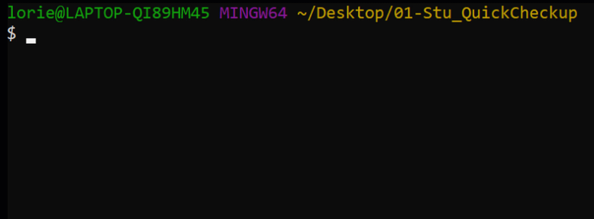
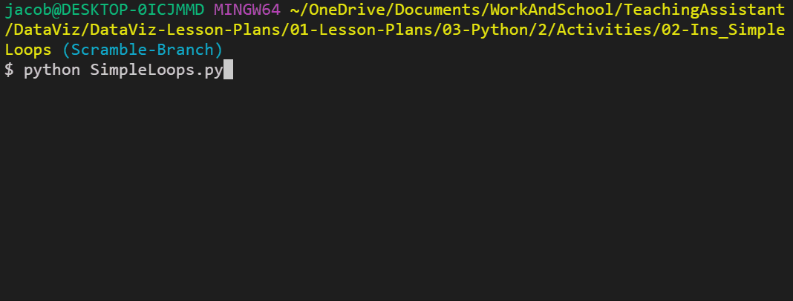
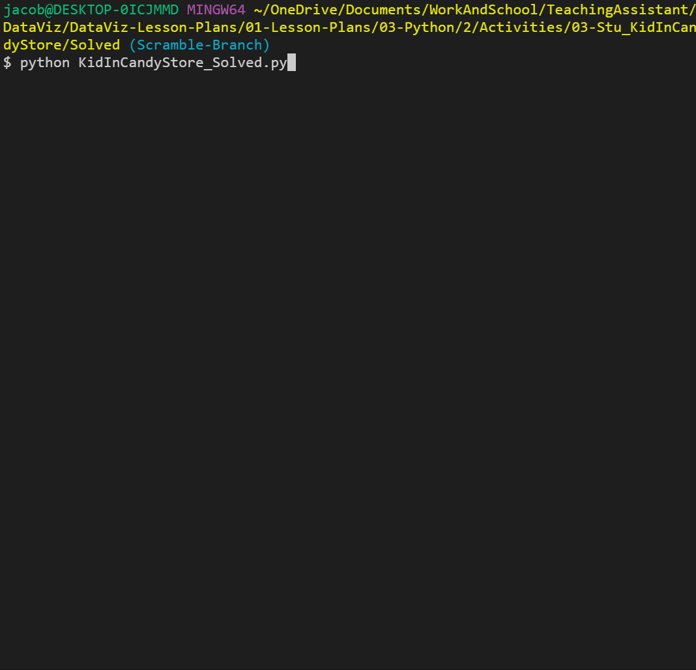
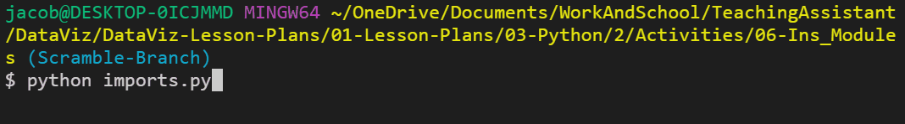
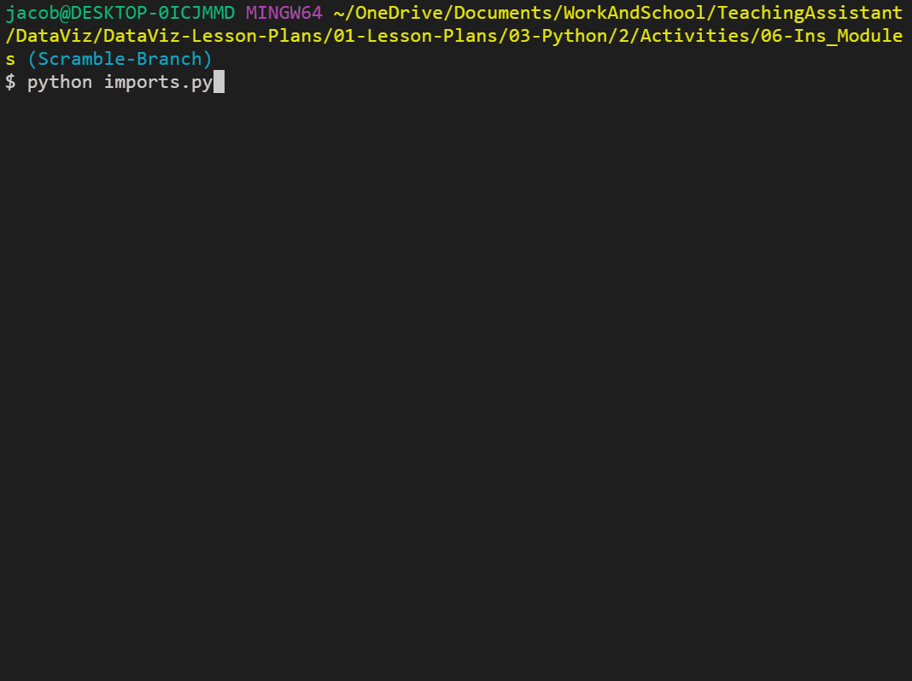
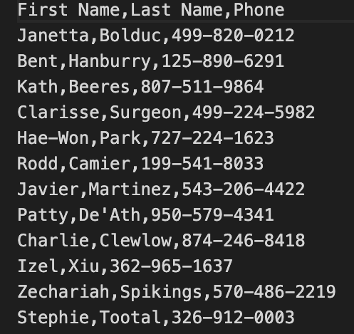
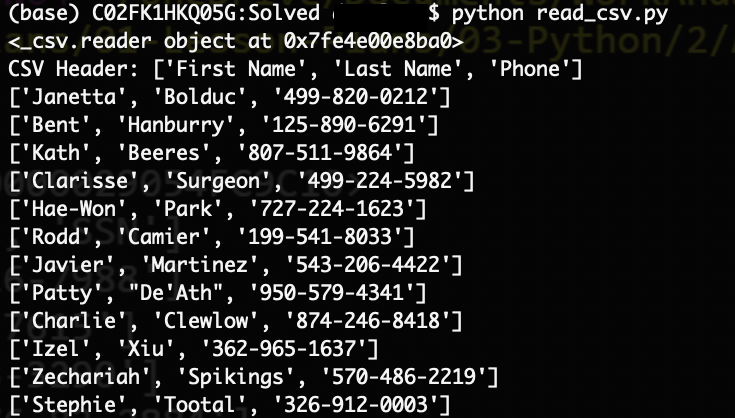
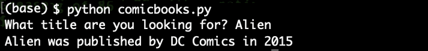
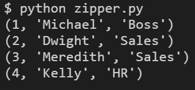
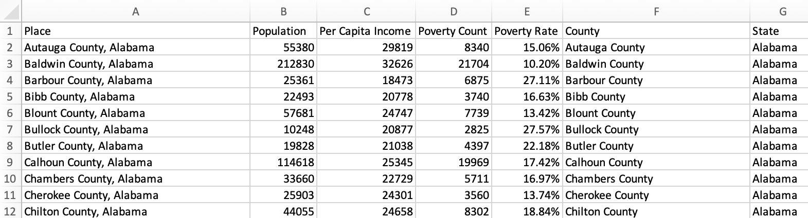

## 3.2 Lesson Plan: Reading and Writing in Python

---

### Overview

In today's class, we will explore reading and writing data from and to external CSV files. Students will also delve into Python dictionaries, zipping lists, and functions.

### Class Objectives

By the end of this lesson, the students will be able to:

* Read data into Python from CSV files.

* Write data from Python to CSV files.

* Zip two lists together.

* Create and use Python functions.

### Instructor Notes

* Today is a challenging but immensely useful class that relates directly to the homework. Challenges aside, students should have some fun today as they work through the lesson’s many activities. Expect some frustration, and provide regular encouragement.

* The first half of today's class is far more relevant to this week's homework than the second half, so feel free to provide students with additional time so they can work through the activities.

---

### Class Slides

* The slides for this lesson can be viewed on Google Drive here: [Lesson Slides](https://docs.google.com/presentation/d/1geG4Y7ymr3JfM0wCo-HCNk6vAoctKAAamw-e4m3aTEE/edit?usp=sharing).

* To add the slides to the student-facing repository, download the slides as a PDF by navigating to File, selecting "Download as," and then choosing "PDF document." Then, add the PDF file to your class repository along with other necessary files. You can view instructions for this [here](https://docs.google.com/document/d/1XM90c4s9XjwZHjdUlwEMcv2iXcO_yRGx5p2iLZ3BGNI/edit?usp=sharing).

* **Note:** Editing access is not available for this document. If you wish to modify the slides, create a copy by navigating to File and selecting "Make a copy...".

---

### Time Tracker

| Start Time | Number | Activity                                           | Duration |
| ---------- | ------ | -------------------------------------------------- | -------- |
| 6:30 PM    | 1      | Instructor Do: Welcome Class                       | 0:05     |
| 6:35 PM    | 2      | Students Do: Python Check-Up                       | 0:10     |
| 6:45 PM    | 3      | Review: Python Check-Up                            | 0:05     |
| 6:50 PM    | 4      | Instructor Do: Loop Recap                          | 0:05     |
| 6:55 PM    | 5      | Students Do: Kid in a Candy Store - Loop Recap     | 0:15     |
| 7:10 PM    | 6      | Review: Kid in a Candy Store                       | 0:05     |
| 7:15 PM    | 7      | Students Do: House of Pies - Advanced Loops        | 0:20     |
| 7:35 PM    | 8      | Review: House of Pies                              | 0:10     |
| 7:45 PM    | 9      | Instructor Do: Reading Text Files                  | 0:05     |
| 7:50 PM    | 10     | Instructor Do: Introduction to Modules             | 0:05     |
| 7:55 PM    | 11     | Students Do: Module Playground                     | 0:05     |
| 8:00 PM    | 12     | Review: Module Playground                          | 0:05     |
| 8:05 PM    | 13     | BREAK                                              | 0:15     |
| 8:20 PM    | 14     | Instructor Do: Reading in CSV Files                | 0:10     |
| 8:30 PM    | 15     | Students Do: Reading Comic Book Data               | 0:15     |
| 8:45 PM    | 16     | Review: Reading Comic Book Data                    | 0:05     |
| 8:50 PM    | 17     | Instructor Do: Writing CSV Files                   | 0:05     |
| 8:55 PM    | 18     | Instructor Do: Zipping Lists                       | 0:05     |
| 9:00 PM    | 19     | Students Do: U.S. Census Zip                       | 0:20     |
| 9:20 PM    | 20     | Review: U.S. Census Zip                            | 0:05     |
| 9:25 PM    | 21     | Instructor Do: Introduction to Functions           | 0:05     |
| 9:30 PM    |        | END                                                |          |

---

### 1. Instructor Do: Welcome Class (5 min)

Open the slideshow and use the first few slides to welcome the class.

Emphasize to students that the more they work with Python, the more sense it will make. Practice makes perfect, even if it doesn’t feel that way today.

---

### 2. Students Do: Python Check-Up (10 min)

**Corresponding Activity:** [01-Stu_QuickCheckup](Activities/01-Stu_QuickCheckup/)

Continue through the slideshow, using the next slides as an accompaniment to this activity.

Since the last class introduced a lot of new material, today's lesson will start with a quick warm-up activity to get the Python juices flowing! Remind students to activate their `dev` environment whenever they open Terminal or GitBash:

```
conda activate dev
```

Run the solution file within the terminal, and briefly introduce the solution, which is captured in the following GIF:



Then, send out the starter file and instructions the instructions in the README file.

---

### 3. Review: Python Check-Up (5 min)

**Corresponding Activity:** [01-Stu_QuickCheckup](Activities/01-Stu_QuickCheckup/)

Send out the solution file and go over the code with the class, answering any questions students may have about the activity.

Cover the following key points during your discussion:

* The `name` variable is set to match the user-input response to the question "What is your name?".

* Since the `favorite_number` variable is taken in as a string, it must be cast as an integer when run through the conditionals, as in the following image:

```python
## Print Hello User!
print("Hello User!")

## Take in User Input
name = input("What is your name? ")

## Respond Back with User Input
print("Hi " + name + "!")

## Take in the User Favorite Number
favorite_number = input("What is your favorite number? ")

## Respond Back with a statement based on your favorite number
if (int(favorite_number) < 7):
  print("Your favorite number is lower than mine.")

elif (int(favorite_number) == 7):
  print("Your favorite number is the same as mine!")

else:
  print("Your favorite number is higher than mine.")
```

---

### 4. Instructor Do: Loop Recap (5 min)

**Corresponding Activity:** [02-Ins_SimpleLoops](Activities/02-Ins_SimpleLoops/)

Continue the slideshow to facilitate discussion of the next topic.

Open up the solution file within the editor to give the class a refresher on creating basic loops, and make sure to share the file with students.

You may want to have the students discuss the code with the people around them before running each `for` loop separately.

* A `for` loop will loop through a range of numbers, the letters in a string, or the elements in a list one at a time, as captured in the following GIF:



* A `while` loop will loop through the code contained inside of the loop until some condition is met, as captured in the following GIF:


Be sure to answer any questions that the class has about loops before moving on to the next activity.

---

### 5. Students Do: Kid in a Candy Store - Loop Recap (15 min)

**Corresponding Activity:** [03-Stu_KidInCandyStore-LoopsRecap](Activities/03-Stu_KidInCandyStore-LoopsRecap/)

Continue through the slideshow, using the next slides as an accompaniment to this activity.

In this activity, students are creating the code that a candy store will use in their state-of-the-art candy vending machine. The following GIF captures the code for this activity:



Open up solution file within the terminal, and run through the application to give students an idea of how it functions.

Then, send out the starter code and the instructions in the README file.

---

### 6. Review: Kid in a Candy Store (5 min)

**Corresponding Activity:** [03-Stu_KidInCandyStore-LoopsRecap](Activities/03-Stu_KidInCandyStore-LoopsRecap/)

Send out the solution file and go over the code with the class, answering whatever questions they may have.

Cover the following key points in your discussion of the code:

* There are three `for` loops being used in this activity. One loop prints out the original candy list. A second loop collects all of the candy choices that the user has. And a third loop prints the final list of choices to the screen.

* When adding candies into the `candy_cart` list, the `selection` variable has to be cast as an integer because all inputs are naturally set as strings.

* To solve the bonus, we would simply use a `while` loop instead of a `for` loop, asking after each selection whether the user would like to make another selection. If they ever answer anything other than "Yes", the loop will stop.

  ```python
  ## The list of candies to print to the screen
  candy_list = [
      "Snickers",
      "Kit Kat",
      "Sour Patch Kids",
      "Juicy Fruit",
      "Swedish Fish",
      "Skittles",
      "Hershey Bar",
      "Starbursts",
      "M&Ms"
  ]

  ## The amount of candy the user will be allowed to choose
  allowance = 5

  ## The list used to store all of the candies selected inside of
  candy_cart = []

  ## Print all of the candies to the screen and their index in brackets
  for candy in candy_list:
      print(f'[{str(candy_list.index(candy))}] {candy}')

  ## Another option to run the for loop involves Python's enumerate method
  ## This method obtains both the index and the value of an item during a for loop
  ## for index, candy in candy_list:
  ##     print(index, candy)

  ## Run through a loop that allows the user to choose which candies to take home with them
  print("Which candy would you like to bring home?")
  for x in range(allowance):
      selected = input("Input the number of the candy you want: ")

      ## Add the candy at the index chosen to the candy_cart list
      candy_cart.append(candy_list[int(selected)])

  ## Loop through the candy_cart to say what candies were brought home
  print("I brought home with me...")
  for candy in candy_cart:
      print(candy)
  ```

---

### 7. Students Do: House of Pies - Advanced Loops (20 min)

**Corresponding Activity:** [04-Stu_HouseOfPies-AdvancedLoops](Activities/04-Stu_HouseOfPies-AdvancedLoops/)

Continue through the slideshow, using the next slides as an accompaniment to this activity.

From one form of sweets to another! In this activity, the class will construct an order form that will display a list of pies and then prompt users to make a selection. It will continue to prompt for selections until the user decides to terminate the process.

This activity comes in two parts: an easy version that is very much like the previous activity and a hard version, which is very challenging. Encourage students to try their luck on the hard version if they are feeling confident.

The following GIF captures the code for this activity:


Open up the bonus solution file within the terminal, and guide students through the application to give them an idea of how it functions.

Then, send the instructions from the README file to students.

---

### 8. Review: House of Pies (10 min)

**Corresponding Activity:** [04-Stu_HouseOfPies-AdvancedLoops](Activities/04-Stu_HouseOfPies-AdvancedLoops/)

Send out the solution file and go over the code with the class, answering whatever questions they may have.

Explain the following key points during this discussion:

* Since the GUI for the application starts with 1, we need to subtract 1 from the user's input when referencing the pie's actual index&mdash;because all indexes start at 0 by default.

* The primary loop being used is a `while` loop that is constantly checking whether the user's response to the question `Would you like to make another purchase?` ever changes from `y`.

* The total number of pies is calculated in the original solution by determining the length of the `pie_purchases` array.

* In the bonus, the code tracks the number of pie purchases for each pie type by using a second list filled with 0 values, each corresponding to a pie in the first list. Therefore, every time a pie is chosen, the code adds one to the index of the `pie_purchases` list, which is equal to that of the original `pie_list`.

  ```python
  ## While we are still shopping...
  while shopping == "y":

      ## Show pie selection prompt
      print("---------------------------------------------------------------------")
      print("(1) Pecan, (2) Apple Crisp, (3) Bean, (4) Banoffee, " +
            " (5) Black Bun, (6) Blueberry, (7) Buko, (8) Burek, " +
            " (9) Tamale, (10) Steak ")

      pie_choice = input("Which would you like? ")

      ## Get index of the pie from the selected number
      choice_index = int(pie_choice) - 1

      ## Add pie to the pie list by finding the matching index and adding one to its value
      pie_purchases[choice_index] += 1

      print("------------------------------------------------------------------------")

      ## Inform the customer of the pie purchase
      print("Great! We'll have that " + pie_list[choice_index] + " right out for you.")

      ## Provide exit option
      shopping = input("Would you like to make another purchase: (y)es or (n)o? ")

  ## Once the pie list is complete
  print("------------------------------------------------------------------------")

  ## Count instances of each pie
  print("You purchased: ")

  ## Loop through the full pie list
  for pie_index in range(len(pie_list)):
      pie_count = str(pie_purchases[pie_index])
      pie_name = str(pie_list[pie_index])

      ## Gather the count of each pie in the pie list and print them alongside the pies
      print(pie_count + " " + pie_name)

---

### 9. Instructor Do: Reading Text Files (5 min)

**Corresponding Activity:** [05-Ins_BasicRead](Activities/05-Ins_BasicRead/)

Continue the slideshow to facilitate discussion of the next topic.

Note that Python is also capable of reading in data from external text files and then performing tasks on that data.

Open up solution file and the `input.txt` file and go over the syntax and purpose of the code, covering the following points as you go:

* When dealing with external files, Python requires precise directions on what path to follow to reach the desired file. Therefore, if the desired file is stored in a subfolder called "Resources", the path needed would be "Resources/FileName.txt".

* It’s critical that you note that different operating systems use different paths to locate files. For example, Windows machines will often use forward slashes to separate folders, and Mac devices will use backslashes.

```python
## Store the file path associated with the file (note the backslash may be OS specific)
file = '../Resources/input.txt'
```

* The `with` statement is simply saying that, for as long as we are dealing with the code within the following block, save the text variable. Once the code block has completed, the text variable will be "cleaned up" and removed to save memory.

* `open(<File Path>, <Read/Write>)` is the function that Python uses to open and work with external text files. By specifying either `'r'`, `'w'`, or `'rw'`, we can use the `open()` function to either read from a text file, write to a text file, or perform both operations in the code block that follows it.

* `text.read()` parses the data that is read in by the `open()` function and converts it to a string type. If this function was not used, all that would be printed to the screen would be an unhelpful text-wrapper object.


```python
## Open the file in "read" mode ('r') and store the contents in the variable "text"
with open(file, 'r') as text:

    ## This stores a reference to a file stream
    print(text)

    ## Store all of the text inside a variable called "lines"
    lines = text.read()

    ## Print the contents of the text file
    print(lines)
```

---

### 10. Instructor Do: Introduction to Modules (5 min)

**Corresponding Activity:** [06-Ins_Modules](Activities/06-Ins_Modules/)

Continue the slideshow to facilitate discussion of the next topic, covering the following points as you go:

Although Python includes many built-in functions, coders sometimes need to add external modules to perform specific tasks.

* For example, if a coder wanted to use a random number generator for a dice game that they were making, they would most likely want to use the `random` module rather than create the code from scratch.

Importing modules into Python is very simple. All we need to do is install the module and import it into our code.

* All of today’s modules come packaged with Python, so there is no need to install anything new.

Open the solution file in your editor and guide the class through the process for importing modules into their code.

* Note that the `string` module contains many helpful constants and methods that pertain to strings. For example, we can use `string.ascii_letters`, and Python will instantly grab a reference to every ASCII character.

```python
## Import the String Module
import string

## Utilize the string module's custom method: ".ascii_letters"
print(string.ascii_letters)
```
* The following GIF demonstrates the outcome when this code is run.



* Explain that the `random` module does exactly what we might expect: it allows Python to randomly select values from set ranges, lists, or even strings.

```python
## Import the Random Module
import random

## Utilize the random module's custom method randint
for x in range(10):
    print(random.randint(1, 10))

```

* The following GIF demonstrates the outcome when this code is run.



---

### 11. Students Do: Module Playground (5 min)

**Corresponding Activity:** [07-Stu_ModulePlayground](Activities/07-Stu_ModulePlayground/)

Continue through the slideshow, using the next slides as an accompaniment to this activity.

There are too many built-in modules in Python for us to cover all of them in one class. Instead, give the students time to go through and play around with some Python modules.

Send out the following link:

**Link:**

* [List of Built-In Python Modules](https://docs.python.org/3/py-modindex.html)

Before moving on, bring the class back together to discuss the modules that they uncovered.

---

### 12. Review: Module Playground (5 min)

**Corresponding Activity:** [07-Stu_ModulePlayground](Activities/07-Stu_ModulePlayground/)

Call the class back together, and ask the students if any modules were particularly useful. Have any volunteers discuss the module that they found and how they would use it.

If no one offers up any modules, call on random students to encourage engagement.

---

### 13. BREAK (15 min)

---

### 14. Instructor Do: Reading in CSV Files (10 min)

**Corresponding Activity:** [08-Ins_ReadCSV](Activities/08-Ins_ReadCSV/)

Continue the slideshow to facilitate discussion of the next topic while covering the following key points:

Although reading in text files can be useful in some circumstances, CSV files are more common in the data industry.

* CSV stands for **comma separated values**. This file type is essentially a table that has been converted into a text format with each row and column separated by specified symbols.

* Most frequently, each row is located on a new line, and each column is separated by a comma, as captured in the following image:

  

Python has a module called `csv`, which allows users to easily pull in data from external CSV files and then perform operations on the data.

Open [08-ReadCSV](Activities/08-Ins_ReadCSV/Solved/read_csv.py) within the editor, and guide the class through the code contained within.

* The first major piece of code to discuss is the import and use of the `os` module. This module allows Python programmers to easily create dynamic paths to external files that will function across different operating systems.

```py
## First we'll import the os module
## This will allow us to create file paths across operating systems
import os
csvpath = os.path.join('..', 'Resources', 'contacts.csv')
```

* In the next major piece of code, point out that we use `csv.reader()` instead of `text.read()` to translate the object being opened by Python. It is critical to note the `delimiter=','` parameter, which tells Python that each comma within the CSV should be read as moving into a new column for a row.

  * Reiterate to students that the reading of the file must be done within the `with open()` statement. The variable `csvreader` will not be useful outside that block of code because the file will be closed when the `with open()` block ends. In a later example, students will learn that one option for working with the data outside of `with open()` is to append it to a list.

```python
import csv
with open(csvpath) as csvfile:

  ## CSV reader specifies delimiter and variable that holds contents
  csvreader = csv.reader(csvfile, delimiter=',')

  print(csvreader)

  ## Read each row of data after the header
  for row in csvreader:
      print(row)
```

* The code then loops through each row of the CSV and prints out the contents. Point out that each value is a string and that all the rows are lists, as captured in the following image:

  

Data Source: Data generated by Mockaroo, LLC. (2021) Realistic Data Generator. https://www.mockaroo.com/. Data for this dataset was generated by edX Boot Camps LLC, and is intended for educational purposes only.

---

### 15. Students Do: Reading Comic Book Data (15 min)

**Corresponding Activity:** [09-Stu_ReadComicBooksCSV](Activities/09-Stu_ReadComicBooksCSV/)

Continue through the slideshow, using the next slides as an accompaniment to this activity.

In this activity, students will be provided with a CSV file containing comic book data from the British Library. They will create an application that searches the data for a specific graphic novel title and then returns the title, publisher's name, and year published.



Open and run the solution file and discuss with students how their application should function, then send out the starter file and instructions.

---

### 16. Review: Reading Comic Book Data (5 min)

**Corresponding Activity:** [09-Stu_ReadComicBooksCSV](Activities/09-Stu_ReadComicBooksCSV/)

Send out the solution file and go over the code with the class, answering whatever questions they may have.

Cover the following key topics when discussing this activity:

* First, Python imports both the `os` and `csv` modules for use later on. It is common practice to import all modules at the start of an application.

* When opening the CSV file, the code dictates that each new line in the file should be viewed as a new line of data to be read in.

* We create a variable, set to `False`, that will be changed only when a title is found. That way, we can alert the user when their title is _not_ found.

```python
## Set path for file
csvpath = os.path.join("..", "Resources", "comic_books.csv")

## Set variable to check if we found the video
found = False
```

* When reading the CSV file, the delimiter is set to `","` to ensure that Python splits up the data into the proper columns whenever a comma is found.

* The code loops through each row, searching for the row whose first value, index 0, is equal to the search term entered.

* The publisher of a book is located at index 8, and the year published is located at index 9.

* The `found` variable is set to `True` so we do not display the "Not Found" message after searching through the CSV file.

```python
## Open the CSV
with open(csvpath) as csvfile:
    csvreader = csv.reader(csvfile, delimiter=",")

    ## Loop through looking for the video
    for row in csvreader:
        if row[0] == book:
            print(row[0] + " was published by " + row[8] + " in " + row[9])

            ## Set variable to confirm we have found the video
            found = True
```

* After the `for` loop is complete, the code displays an apology message if the `found` variable is still set to `False`.

```python
  ## If the book is never found, alert the user
  if found is False:
      print("Sorry about this, we don't seem to have what you are looking for!")
```

Data Source: Data modified from "Comic books CSV" Updated April 2021. Initially released in 2014 to accompany the British Library's exhibition Comics Unmasked. [https://www.bl.uk/collection-metadata/downloads](https://www.bl.uk/collection-metadata/downloads)

---

### 17. Instructor Do: Writing CSV Files (5 min)

**Corresponding Activity:** [10-Ins_WriteCSV](Activities/10-Ins_WriteCSV/)

Continue the slideshow to facilitate discussion of the next topic.

Cover the following key points:

* Explain that Python can also write data _into_ CSV files.

* Although this may not seem useful at first, it allows Python users to easily modify and/or create datasets based on previous data.

Open the solution file within the editor, send the file to students, and go through the code with the class, explaining each line as you proceed.

* The syntax for writing data into a CSV file is, thankfully, very similar to the syntax used for reading data in from an external file.

* First, the code references the path to the CSV file that the user would like to write to.

* Next, the `with open()` statement is used once more, but with one significant difference: instead of passing the parameter `'r'` and directing Python to read a file, the parameter `'w'` is passed to inform Python to write to the file.

* Instead of `csv.reader()`, `csv.writer()` is used to once again inform Python that this application will be writing code into an external CSV file.

* To write a new row into a CSV file, simply use the `csv.writerow(<DATA LIST>)` function and pass in an array of data as the parameter, as in the following image:


Run the code, then open up the new CSV file and briefly discuss what the code accomplished.

---

### 18. Instructor Do: Zipping Lists (5 min)

**Corresponding Activity:** [11-Ins_Zip](Activities/11-Ins_Zip/)

Continue the slideshow to facilitate discussion of the next topic while covering the following key points:

Although it is possible to write new rows of data into a CSV file using many `csv.writerow()` statements, Python users can write data into a new CSV file more efficiently by using the `zip()` function.

* `zip()` takes in a series of lists as its parameters and joins them together in a stack.

Open up solution file within the editor, and go through the code with the class, explaining each line as you go.

* This application has three lists, all of which are the same length and pertain to each other. By zipping these lists together, there is now a single, joined list whose indexes reference all three of the lists inside.

* Zipped lists are lazy iterators, so their output is not stored in memory and iterated over but generated at each iteration and discarded. This means each zipped object can only be used once. For example, you can write the zipped object to a CSV or print it to the terminal, but you cannot do both. We will cast our zipped object to a list to ensure it can be used for both writing to a CSV and printing to the terminal.

```python
## Three Lists
indexes = [1, 2, 3, 4]
employees = ["Michael", "Dwight", "Meredith", "Kelly"]
department = ["Boss", "Sales", "Sales", "HR"]

## Zip all three lists together into tuples
roster = list(zip(indexes, employees, department))

## Print the contents of each row
for employee in roster:
    print(employee)
```

The output of this code is captured in the following image:




* In order to save the contents of the zipped list to a CSV, the for loop must be commented out or removed, and the following code can be used instead.

```python
## save the output file path
output_file = os.path.join("output.csv")

## open the output file, create a header row, and then write the zipped object to the csv
with open(output_file, "w", newline='') as datafile:
    writer = csv.writer(datafile)

    writer.writerow(["Index", "Employee", "Department"])

    writer.writerows(roster)
```

---

### 19. Students Do: U.S. Census Zip (20 min)

**Corresponding Activity:** [12-Stu_CensusZip](Activities/12-Stu_CensusZip/)

Continue through the slideshow, using the next slides as an accompaniment to this activity.

Now that students have a decent idea of how to write and read data to and from CSV files, they will revisit data from the U.S. Census, clean it up, and create a new CSV file that is easier to comprehend, as captured in the following image:



Compare the starter csv file to the final csv file of this activity, explain to students how their application should function, and then send out the starter file and instructions.

---

### 20. Review: U.S. Census Zip (5 min)

**Corresponding Activity:** [12-Stu_CensusZip](Activities/12-Stu_CensusZip/)

Open and send out the solution file of the previous activity, and go over the code line by line with the class, answering whatever questions they may have.

Cover the following key points during this discussion:

* Seven empty lists are created at the start of this application. These lists will be used to hold specific data from the original CSV, and they will ultimately be zipped together before being written to a new CSV file.

* For every new row that is read in from the original CSV file, new data is appended onto the lists. In the cases of `poverty_rate`, `county`, and `state`, the data is being altered before it is placed in the list.

```py
## Lists to store data
place = []
population = []
income = []
poverty_count = []
poverty_rate = []
county = []
state = []

with open(census_csv) as csvfile:
    csvreader = csv.reader(csvfile, delimiter=",")
    for row in csvreader:
        ## Add place
        place.append(row[0])

        ## Add population
        population.append(row[1])

        ## Add per capita income
        income.append(row[4])

        ## Add poverty count
        poverty_count.append(row[8])

        ## Determine poverty rate to 2 decimal places, convert to string
        percent = round(int(row[8]) / int(row[1]) * 100, 2)
        poverty_rate.append(str(percent) + "%")

        ## Split the place into county and state
        split_place = row[0].split(", ")
        county.append(split_place[0])
        state.append(split_place[1])
```

* Once all data has been read in, the lists are zipped together and written into a new CSV file. A header row is also written in before the zipped rows.

```py
## Zip lists together
cleaned_csv = list(zip(place, population, income, poverty_count, poverty_rate, county, state))

## Set variable for output file
output_file = os.path.join("census_final.csv")

##  Open the output file
with open(output_file, "w", newline='') as datafile:
    writer = csv.writer(datafile)

    ## Write the header row
    writer.writerow(["Place", "Population", "Per Capita Income", "Poverty Count", "Poverty Rate",
                    "County", "State"])

    ## Write in zipped rows
    writer.writerows(cleaned_csv)
```

---

### 21. Instructor Do: Introduction to Functions (5 min)

**Corresponding Activity:** [13-Ins_Functions](Activities/13-Ins_Functions/)

Continue the slideshow to facilitate discussion of the next topic while covering the following key points:

DRY is a popular acronym that many coders live by. It stands for **d**on't **r**epeat **y**ourself**, and it essentially states we should avoid similar/repeated lines in code whenever possible.

One of the best ways to prevent repetition is the frequent use of Python functions.

* A function is a block of organized, reusable code that can perform a single, related action. In other words, functions are placeable blocks of code that perform a specific action.

Open up the solution file within the editor, and go through the code line by line with your class.

* To create a new function, simply use `def <Function Name>():` and then place the code that you would like to run within the block underneath it.

* To run the code stored within a function, the function itself must be called in the program. Functions will not run unless called upon.

  ```python
  def print_hello():
    print(f"Hello!")

  print_hello()
  ```

* Functions that take in parameters can also be created simply by adding a variable into the parentheses in the function's definition. This allows specific data to be passed into the function.

  ```python
  def print_name(name):
      print("Hello " + name + "!")

  print_name("Bob Smith")
  ```

---

### End Class

---

© 2022 edX Boot Camps LLC. Confidential and Proprietary. All Rights Reserved.
