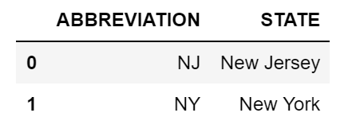

## 4.1 Introduction to Pandas and Jupyter

### Overview

Today's lesson will introduce students to Jupyter notebook and the basics of the Pandas module.

### Class Objectives

By the end of this lesson, the students will be able to:

* Serve Jupyter notebook files from local directories and connect to their development environment.

* Create Pandas DataFrames from scratch.

* Run functions on Pandas DataFrames.

* Read and write DataFrames to and from CSV files by using Pandas.

---

### Instructor Notes

In this module, we introduce the `pandas` library. This curriculum has been tested with Python 3.10, but updates to packages and variances in student machines can still cause conflicts to occur. If a student has an error that you believe to be related to Python 3.10, at your discretion you can instruct them to create a new environment using a different Python version. If you believe that an update has introduced a bug at a curriculum level, attempt to find a suitable workaround for the moment and submit a report using the Boot Camp Feedback Form.

* The objective of today's class is to introduce students to Pandas, so the tone of the lesson should be exploratory. Emphasize that it's normal for students to ask questions and make mistakes as they get started with this challenging module.

* Common issues with Jupyter notebook may become apparent right from the start, so a list of these problems and their solutions will be provided to students for the first activity. It is critical that the Jupyter notebook runs properly on every student’s machine; we will be using it regularly for the remainder of the course.

* Pandas is not an easy topic to learn; the syntax is complicated and can easily confuse beginners. Patience and perseverance will be key. Frequently reassure students that practice will make perfect and that Pandas' quirks will be easier to manage before too long.

---

### Class Slides

* The slides for this lesson can be viewed on Google Drive here: [Lesson 4.1 slides](https://docs.google.com/presentation/d/1IG88FcK2Ip21H4E3MmxbqlxChnQCPTffs9DXjoXhkHg/edit?usp=sharing).

* To add the slides to the student-facing repository, download the slides as a PDF by navigating to File, selecting "Download as," and then choosing "PDF document." Then, add the PDF file to your class repository along with other necessary files. You can view instructions for this [here](https://docs.google.com/document/d/1XM90c4s9XjwZHjdUlwEMcv2iXcO_yRGx5p2iLZ3BGNI/edit?usp=sharing).

* **Note:** Editing access is not available for this document. If you wish to modify the slides, create a copy by navigating to File and selecting "Make a copy...".

---

### Time Tracker

| Start Time | Number | Activity                                           | Duration |
| ---------- | ------ | -------------------------------------------------- | -------- |
| 6:30 PM    | 1      | Instructor Do: Welcome Class                       | 0:05     |
| 6:35 PM    | 2      | Instructor Do: Introduction to Jupyter Notebook    | 0:10     |
| 6:45 PM    | 3      | Students Do: Comic Book Remix                      | 0:15     |
| 7:00 PM    | 4      | Review: Comic Book Remix                           | 0:05     |
| 7:05 PM    | 5      | Instructor Do: Introduction to Pandas              | 0:05     |
| 7:10 PM    | 6      | Instructor Do: Creating Pandas DataFrames          | 0:05     |
| 7:15 PM    | 7      | Students Do: DataFrame Shop                        | 0:15     |
| 7:30 PM    | 8      | Review: DataFrame Shop                             | 0:05     |
| 7:35 PM    | 9      | Instructor Do: DataFrame Functions                 | 0:05     |
| 7:40 PM    | 10     | Students Do: Training Grounds                      | 0:15     |
| 7:55 PM    | 11     | Review: Training Grounds                           | 0:05     |
| 8:00 PM    | 12     | Instructor Do: Modifying Columns                   | 0:05     |
| 8:05 PM    | 13     | Students Do: Hey Arnold!                           | 0:10     |
| 8:15 PM    | 14     | Review: Hey Arnold!                                | 0:05     |
| 8:20 PM    | 15     | BREAK                                              | 0:15     |
| 8:35 PM    | 16     | Instructor Do: Reading and Writing CSV Files       | 0:05     |
| 8:40 PM    | 17     | Students Do: Comic Books Part 1                    | 0:20     |
| 9:00 PM    | 18     | Review: Comic Books Part 1                         | 0:05     |
| 9:05 PM    | 19     | Students Do: Comic Books Part 2                    | 0:20     |
| 9:25 PM    | 20     | Review: Comic Books Part 2                         | 0:05     |
| 9:30 PM    |        | END                                                |          |

---

### 1. Instructor Do: Welcome Class (5 min)

Open the slides and use the first few slides to welcome the class and cover the following points:

* Welcome the students to one of the most challenging weeks of the entire course. Challenges aside, the Pandas module is an extremely powerful tool that will be worth their effort.

* Note that Pandas will become easier with time and practice. Reassure the students that despite the challenges that they may face, learning Pandas will make their lives as analysts easier.

---

### 2. Instructor Do: Introduction to Jupyter Notebook (10 min)

**Corresponding Activity:** [01-Ins_Jupyter_Intro](Activities/01-Ins_Jupyter_Intro)

Continue through the slideshow while covering the following points:

Take some time to introduce Jupyter notebook before we delve into Pandas:

* Jupyter notebook is an open-source application that allows users to create documents that contain live code, equations, visualizations, and explanatory text.

* In other words, Jupyter notebook combines the text editor, the console, and the markdown file into one application.

* Have the students activate their `dev` development environment with `conda activate dev`.

* Point out that the `dev` environment will be the default for Jupyter notebook. Confirm this by having the students run: `jupyter kernelspec list`.

  * The output should be similar to the following:

    ```text
    Available kernels:
    python3      /opt/anaconda3/envs/dev/share/jupyter/kernels/python3
    ```

* Next, have the students launch Jupyter notebook by typing `jupyter notebook` into the terminal, as captured in the following image:

  

  * Running `jupyter notebook` will automatically open a webpage where users can navigate into any files or folders within the folder they ran the command from.

  * Users can create new Jupyter notebook files from the webpage by clicking the **New** button and selecting `Python 3` kernel from the dropdown list.  The following image captures what a user will see when launching Jupyter notebook, including the "New" button in the upper right corner.

    

  * This kernel will contain all the libraries that were installed in the `dev` Conda environment.

  * Python files created through Jupyter notebook are given the `ipynb` extension rather than `py`, and they cannot be easily read or altered within a typical text editor.

* Open [jupyter_intro_solution.ipynb](Activities/01-Ins_Jupyter_Intro/Solved/jupyter_intro_solution.ipynb) in Jupyter notebook  and point out how the Jupyter organizes Python code into cells.

  * Explain how each cell contains Python code that we can run independently by placing the cursor inside the cell and pressing **Shift + Enter**.

  * Modify some of the code in a cell, and describe how Jupyter notebook allows users to experiment with the code directly _and_ save it for later.

  * Make sure to run the second-to-last cell one more time after running the final cell on its own. Note to students that values in Jupyter notebooks are stored based on what lines of code were run last.

---

 ### 3. Students Do: Comic Book Remix (15 min)

**Corresponding Activity:** [02-Stu_Comics_Remix_Jupyter](Activities/02-Stu_Comics_Remix_Jupyter/)

Continue the slideshow to introduce this activity to the class.

For this activity, the students will create a Jupyter notebook to perform the same functions as the Comic Book activity from the previous unit.

---

### 4. Review: Comic Book Remix (5 min)

You may choose to use the slideshow as you go through the code.

Open and share the [comics_remix_solution.ipynb](Activities/02-Stu_Comics_Remix_Jupyter/Solved/comics_remix_solution.ipynb) file, then go through the code with the class, answering any questions that students may have.

* Cover the following key points as you review the activity:

  * We can run the code within a cell by placing the cursor inside of the cell and pressing **Shift + Enter**.

  * If the code within a cell is not run, then any changes made within will not be saved into memory.

  * The code contained in a Jupyter notebook is not linear. For example, if two cells modify the same variable, then the block of code that was run most recently will determine the value of the variable.

Data Source: Data modified from "Comic books CSV" Updated April 2021. Initially released in 2014 to accompany the British Library's exhibition Comics Unmasked. [https://www.bl.uk/collection-metadata/downloads](https://www.bl.uk/collection-metadata/downloads)

---

### 5. Instructor Do: Introduction to Pandas (5 min)

Continue using the slideshow to cover the talking points for this section:

Jupyter notebook’s code testing and visualization capabilities really start to shine through when these principles are applied to large tables. However, as the students have likely realized, it can be very stressful to modify huge datasets using pure Python.

* Thankfully, the Pandas library is extraordinarily powerful when it comes to visualizing, analyzing, and altering large datasets.

* Although Python is stuck using lists, tuples, and dictionaries, Pandas lets Python programmers work with **Series** and **DataFrames**.

  * These two data types, unique to Pandas, are essentially structured lists with many built-in convenience methods that allow for quick and easy data manipulation.

  * A Pandas Series is a one-dimensional labeled array capable of holding any data type. This means that, like an array, the data is linear, and like a dictionary, it has an index that acts as a key. This is shown in the following image:

    

  * A Pandas DataFrame is a two-dimensional labeled data structure with columns of potentially different data types. We can think of a DataFrame as an Excel spreadsheet where each column is a Series, as in the following image:

    

---

### 6. Instructor Do: Creating Pandas DataFrames (5 min)

**Corresponding Activity:** [03-Ins_Pandas_Intro](Activities/03-Ins_Pandas_Intro)

Continue using the slideshow as you begin to discuss the next activity.

Open [creating_data_frames_solution.ipynb](Activities/03-Ins_Pandas_Intro/Solved/creating_data_frames_solution.ipynb) within Jupyter notebook, and demonstrate to the class what Pandas Series and DataFrames are and how to create them. Cover the following key points:

* First, the Pandas library is imported using `import pandas as pd`. This method of import allows Pandas functions and methods to be called using the variable `pd`.

* To create a Series, simply use the `pd.Series()` function and place a list within the parentheses as follows:

  ```python
  # We can create a Pandas Series from a raw list
  data_series = pd.Series(["UCLA", "UC Berkeley", "UC Irvine",
                          "University of Central Florida", "Rutgers University"])
  data_series
  ```

  * The index for the values in the Series will be the numeric index of the initial list, as captured in the following image:

    

* There’s more than one way to create DataFrames from scratch. One way is to use the `pd.DataFrame()` function and provide it with a list of dictionaries. Each dictionary will represent a new row where the keys become column headers and the values are placed inside the table.

* Another way to use the `pd.DataFrame()` function is to provide it with a dictionary of lists. The keys of the dictionary will be the column headers, and the listed values will be placed into their respective rows as the following code shows:

  ```python
  # Convert a list of dictionaries into a DataFrame
  states_dicts = [{"STATE": "New Jersey", "ABBREVIATION": "NJ"},
                  {"STATE": "New York", "ABBREVIATION": "NY"}]

  states_df = pd.DataFrame(states_dicts)
  states_df

  # Convert a single dictionary containing lists into a DataFrame
  pharaoh_df = pd.DataFrame(
      {"Dynasty": ["Early Dynastic Period", "Old Kingdom"],
      "Pharaoh": ["Thinis", "Memphis"]
      }
  )
  pharaoh_df
  ```


---

### 7. Students Do: DataFrame Shop (15 min)

**Corresponding Activity:** [04-Stu_DataFrameShop_Pandas](Activities/04-Stu_DataFrameShop_Pandas/)

Continue the slideshow to introduce this activity to the class.

Students will now try to create DataFrames from scratch using the two methods we just discussed. This activity will also give them the opportunity to better understand DataFrame structure.

---

### 8. Review: DataFrame Shop (5 min)

Continue using the slideshow to facilitate a review of the activity.

Open [DataFrame_shop_solution.ipynb](Activities/04-Stu_DataFrameShop_Pandas/Solved/DataFrame_shop_solution.ipynb) within Jupyter notebook, share the file with the students, and go through the code with the class, answering any questions that students may have.

Cover the following key points in your review of this activity:

* It is important to save the created DataFrames to a variable; otherwise, they will only be printed to the screen, and they will not be available for use later.

* Although the list-of-dictionaries method of DataFrame creation is viable, it takes longer to write the code because the keys have to be rewritten each time. However, it does allow the programmer to better understand each row in their DataFrame as the following code shows:

  ```python
  # Create a DataFrame from a list of dictionaries.
  painting_df = pd.DataFrame([
      {"Painting": "Mona Lisa (Knockoff)", "Price": 25,
      "Popularity": "Very Popular"},
      {"Painting": "Van Gogh (Knockoff)", "Price": 20, "Popularity": "Popular"},
      {"Painting": "Starving Artist", "Price": 10, "Popularity": "Average"},
      {"Painting": "Toddler Drawing", "Price": 1, "Popularity": "Not Popular"}
  ])
  painting_df
  ```

  

* The dictionary-of-lists method is more time-effective because the keys only need to be written once as the following code shows. The DataFrame can be harder to read through, however, as if even one of the lists contains fewer values than the others, then an error will be returned.

  ```python
  # Create a DataFrame of frames using a dictionary of lists.
  frame_df = pd.DataFrame({
      "Frame": ["Ornate", "Classical", "Modern", "Wood", "Cardboard"],
      "Price": [15.00, 12.50, 10.00, 5.00, 1.00],
      "Sales": [100, 200, 150, 300, "N/A"]
  })
  frame_df
  ```

   

---

### 9. Instructor Do: DataFrame Functions (5 min)

**Corresponding Activity:** [05-Ins_Data_Functions](Activities/05-Ins_Data_Functions)

Continue using the slideshow to cover the following talking points:

* Table visualization is not the only benefit of using Pandas DataFrames. Many of the functions/methods that come packaged with Pandas allow for quick and easy analysis of large datasets.

Open [data_functions_solution.ipynb](Activities/05-Ins_Data_Functions/Solved/data_functions_solution.ipynb) within Jupyter notebook, share the file with the students, and make sure to point out how an external CSV file is being imported. Students will learn how to do this later in today's lesson.

* The first method to describe is `head()`, which takes a DataFrame and presents only the first five rows of data inside of it. This number can be increased or decreased by placing an integer within the parentheses.

* The `head()` method is helpful because it allows the programmer to check a minified version of a larger table; then, they can make informed changes without searching through the entire dataset.

* Another useful method is `describe()`, which will print out a DataFrame containing some analysis of the table and its columns. It also indicates some of the other data functions that can be performed on a DataFrame or Series, such as `count()`, `mean()`, `std()`, `min()`, and `max()`. This is captured in the following image:

  

* Most data functions can also be performed on a Series by referencing a single column within the whole DataFrame. Similar to referencing a key within a dictionary, we’d take the DataFrame and follow it up with brackets containing the desired column's header.

* Multiple columns can be referenced, as well, by placing all of the column headers desired within a pair of double brackets. If two sets of brackets are not used, then Pandas will return an error.

* The following image captures three examples of how specific columns can be referenced and used.

  

* In some situations, it is helpful to list out all of the unique values stored within a column. This is precisely what the `unique()` function does as the following code shows:

  ```python
  # The unique method shows every element only once
  unique = data_file_df["Car"].unique()
  unique
  ```

  * The result is an array containing all the different values:

    

* Another method with similar functionality is `value_counts()`, which not only returns a list of all unique values within a series but also counts how many times a value appears, as the following code shows:

  ```python
  # The value_counts method counts unique values in a column
  count = data_file_df["Gender"].value_counts()
  count
  ```

  * The following image shows the value counts of each unique value in the "Gender" column:

    

* Calculations can also be performed on columns and then added into the DataFrame as a new column by referencing the DataFrame, placing the desired column header within brackets, and then setting it equal to a Series, as the following code shows:

  ```python
  # Calculations can also be performed on Series and added into DataFrames as new columns
  thousands_of_dollars = data_file_df["Amount"]/1000
  data_file_df["Thousands of Dollars"] = thousands_of_dollars

  data_file_df.head()
  ```

  * The following image shows the DataFrame:

    

Data Source: Data generated by Mockaroo, LLC. (2021) Realistic Data Generator. [https://www.mockaroo.com/](https://mockaroo.com/). Data for this dataset was generated by edX Boot Camps LLC, and is intended for educational purposes only.

---

### 10. Students Do: Training Grounds (15 min)

**Corresponding Activity:** [06-Stu_TrainingGrounds_DataFunctions](Activities/06-Stu_TrainingGrounds_DataFunctions/)

Continue through the slideshow, using the next slides as an accompaniment to this activity.

---

### 11. Review: Training Grounds (5 min)

Continue using the slideshow to facilitate a review of the activity.

Open and share [training_grounds_solution.ipynb](Activities/06-Stu_TrainingGrounds_DataFunctions/Solved/training_grounds_solution.ipynb), and go through the code with the class, answering any questions that students may have.

* Cover the following key points when discussing this activity:

  * By collecting the unique values for the "Trainer" column, it’s much easier to identify the employees who are currently with the "Training Grounds" gym.

  * To convert "Membership (Days)" into "Membership (Weeks)", the code simply takes the values stored within the initial column, divides them by seven, and then adds this edited Series into a newly created column:

    ```python
    # Convert the membership days into weeks and then adding a column to the DataFrame
    weeks = training_df["Membership (Days)"]/7
    training_df["Membership (Weeks)"] = weeks

    training_df.head()
    ```

    * The output is a DataFrame containing the newly created "Membership (Weeks)":

      


---

### 12. Instructor Do: Modifying Columns (5 min)

**Corresponding Activity:** [07-Ins_Column_Manipulation](Activities/07-Ins_Column_Manipulation)

Continue using the slideshow to cover the following talking points:

As the class discovered in the previous activity, columns within a DataFrame are not always placed in the desired position by default. Sometimes they may not even have a descriptive or concise-enough name.

* Thankfully, it’s very easy to modify the name or placement of a column with the `rename()` function and the use of double brackets.

* Open [column_manipulation_solution.ipynb](Activities/07-Ins_Column_Manipulation/Solved/column_manipulation_solution.ipynb) within Jupyter notebook, and go through the code with the class.

  * To collect a list of all the columns contained within a DataFrame, simply use the `df.columns` call, and an object containing the column headers will be printed to the screen.

  * To reorder the columns, create a reference to the DataFrame followed by two brackets with the column headers placed in the desired order as follows:

    ```python
    # Reorganize the columns using double brackets
    organized_df = training_df[["Name","Trainer","Weight","Membership(Days)"]]
    organized_df.head()
    ```

  * It is also possible to remove columns by simply not creating a reference to them. This will, in essence, drop them from the newly made DataFrame.

  * To rename the columns within a DataFrame, use the `df.rename()` method and place `columns={}` within the parentheses. Inside the dictionary, the keys should be references to the current columns, and the values should be the desired column names as the following code shows:

    ```python
    # Use .rename(columns={}) to rename columns
    renamed_df = organized_df.rename(columns={"Membership(Days)":"Membership in Days", "Weight":"Weight in Pounds"})
    renamed_df.head()
    ```

  * The following image captures how to rename the columns of a DataFrame.

    

---

### 13. Students Do: Hey Arnold! (10 min)

**Corresponding Activity:** [08-Stu_Hey_Arnold_DataFrame_Formatting](Activities/08-Stu_Hey_Arnold_DataFrame_Formatting/)

Continue through the slideshow, using the next slides as an accompaniment to this activity.

Now, the students will take a pre-made DataFrame of "Hey Arnold!" characters and reorganize it so it is easier to understand.

---

### 14. Review: Hey Arnold! (5 min)

Continue using the slideshow to facilitate a review of the activity.

Open [hey_arnold_solution.ipynb](Activities/08-Stu_Hey_Arnold_DataFrame_Formatting/Solved/hey_arnold_solution.ipynb) within Jupyter notebook, and go through the code with the class, answering any questions that students may have.

Cover the following key points when discussing this activity:

* First, we take the currently named columns, convert them into the more readable versions using the following code:

  ```python
  # Rename columns for readability
  hey_arnold_renamed_df = hey_arnold_df.rename(columns={"Character_in_show": "Character",
                                                  "color_of_hair": "Hair Color",
                                                  "Height": "Height",
                                                  "Football_Shaped_Head": "Football Head"
                                                  })
  hey_arnold_renamed_df
  ```

* Then, using double brackets, the new columns are reorganized and placed into another new variable, which now holds the fully formatted DataFrame as the following code demonstrates:

  ```python
  # Organize the columns so they are in a more logical order
  hey_arnold_alphabetical_df = hey_arnold_renamed_df[[
      "Character", "Football Head", "Hair Color", "Height"]]

  hey_arnold_alphabetical_df
  ```

* The following image captures how to reorganize the DataFrame columns:

  

---

### 15. BREAK (15 min)

---

### 16. Instructor Do: Reading and Writing CSV Files (5 min)

**Corresponding Activity:** [09-Ins_Reading_Writing_CSV](Activities/09-Ins_Reading_Writing_CSV)

Continue using the slideshow to cover the following talking points:

Up to this point, the class has manually created DataFrames using the `pd.DataFrame()` method. Now, they’ll learn a how to create DataFrames from external CSV files.

Open [pandas_reading_files_solution.ipynb](Activities/09-Ins_Reading_Writing_CSV/Solved/pandas_reading_files_solution.ipynb) within Jupyter notebook, and go through the code with the class.

* First, we import the Pandas library as `pd`, and import the `Path` function from the `pathlib` module that will allow us to create the path to a file:

  ```python
  # Dependencies
  import pandas as pd
  from pathlib import Path
  ```

* Next, we create a variable that holds the file path, then read the data file using the Pandas `pd.read_csv()` method as follows:

    ```python
  # Store filepath in a variable
  file_one = Path("Resources/DataOne.csv")

  # Read our data file with the Pandas library
  # Not every CSV requires an encoding, but be aware this can come up
  file_one_df = pd.read_csv(file_one, encoding="ISO-8859-1")
  file_one_df.head()
  ```

* In most cases, it is not important to use or define the encoding of the base CSV file; however, if the encoding is different than `'utf-8'`, then it may become necessary so that the CSV is translated correctly.

* The following image captures the code in Jupyter notebook for how to read a CSV file with ISO-8859-1 encoding into Pandas and then display the head of its contents.

  

* It is just as easy to write to a CSV file as it is to read from one. Simply use the `df.to_csv()` method, and pass the path to the desired output file as the following code shows:

  ```python
  # Export file as a CSV, without the Pandas index, but with the header
  file_one_df.to_csv("Output/fileOne.csv", index=False, header=True)
  ```

  * By using the `index` and `header` parameters, programmers can also manipulate whether they would like the index or header for the table to be passed as well, as captured in the following image:

* Pandas can only write to a new CSV file in directories that already exist. If the path to the output file contains a directory that doesn’t exist, Pandas will return a `FileNotFoundError`.

Data Source: Data generated by Mockaroo, LLC. (2021) Realistic Data Generator. [https://www.mockaroo.com/](https://mockaroo.com/). Data for this dataset was generated by edX Boot Camps LLC, and is intended for educational purposes only.

---

### 17. Students Do: Comic Books Part 1 (20 min)

**Corresponding Activity:** [10-Stu_Comic_Books_CSV](Activities/10-Stu_Comic_Books_CSV/)

Continue through the slideshow, using the next slides as an accompaniment to this activity.

The students will now take a large CSV file containing comic books, read it into Jupyter notebook using Pandas, clean up the columns, and then write their modified DataFrame to a new CSV file.

Open the unmodified [comic_books_expanded.csv](Activities/10-Stu_Comic_Books_CSV/Unsolved/Resources/comic_books_expanded.csv) file to show the students what they will be working with; then, open and discuss [books_clean.csv](Activities/10-Stu_Comic_Books_CSV/Solved/Output/books_clean.csv) to give students an idea of the finished product.

---

### 18. Review: Comic Books Part 1 (5 min)

Continue using the slideshow to facilitate a review of the activity.

Open [comic_books_solution.ipynb](Activities/10-Stu_Comic_Books_CSV/Solved/comic_books_solution.ipynb), send the file to students, and go through the code with the class, answering any questions that students may have.

Cover the following key points when discussing this activity:

* The initial CSV file is encoded using UTF-8, so it should also be read in using this encoding to ensure that there are no strange characters hidden within the dataset. `.tail()` can be used to view some of these special characters at the end of this DataFrame, as captured in the following image:

  

* Next, we remove unneeded columns as the following code shows:

  ```python
    # Remove unnecessary columns from the DataFrame and save the new DataFrame
    # Only keep: "ISBN", "Title", "Other titles", "Name", "All names",
    # "Country of publication", "Place of publication", "Publisher", "Date of publication"
    reduced_df = books_df[["ISBN", "Title", "Other titles", "Name", "All names",
                          "Country of publication", "Place of publication",
                          "Publisher", "Date of publication"]]
    reduced_df.head()
    ```

* Then, we rename some of the columns as follows:

  ```python
  # Rename the headers to be more explanatory
  renamed_df = reduced_df.rename(columns={"Other titles": "Other Titles",
                                          "Name": "Author",
                                          "All names": "All Names",
                                          "Country of publication": "Country of Publication",
                                          "Place of publication": "Place of Publication",
                                          "Date of publication": "Publication Year", })
  renamed_df.head()
  ```

  * The result is a cleaned DataFrame that is ready to export.

    

* The path to the output CSV must point to an already-existing CSV, as in the following image; otherwise, an error will be returned. The encoding for the output CSV should also be set as UTF-8 so those strange symbols from earlier do not reappear, as demonstrated with the following code:

  ```python
  # Push the remade DataFrame to a new CSV file
  renamed_df.to_csv("Output/books_clean.csv",
                  encoding="utf-8", index=False, header=True)
  ```

Data Source: Data modified from "Comic books CSV" Updated April 2021. Initially released in 2014 to accompany the British Library's exhibition Comics Unmasked. [https://www.bl.uk/collection-metadata/downloads](https://www.bl.uk/collection-metadata/downloads)

---

### 19. Students Do: Comic Books Part 2 (20 min)

**Corresponding Activity:** [11-Stu_Comic_Books_Summary](Activities/11-Stu_Comic_Books_Summary/)

Students will now take the modified version of the comic book DataFrame and create a new summary DataFrame based on that dataset, using some of Pandas' built-in data functions.

Return to the slideshow to introduce the activity and read the instructions to the students.

---

### 20. Review: Comic Books Part 2 (5 min)

Continue using the slideshow to facilitate a review of the activity.

Open [comic_books_summary_solution.ipynb](Activities/11-Stu_Comic_Books_Summary/Solved/comic_books_summary_solution.ipynb), and go through the code with the class, answering any questions that students may have.

Cover the following key points when reviewing this activity:

* The count of unique authors and unique publications can be found by using the following code:

  ```python
  # Calculate the number of unique authors in the DataFrame
  author_count = len(comics_df["Author"].unique())

  # Calculate the number of unique publication countries in the DataFrame
  country_count = len(comics_df["Country of Publication"].unique())
  ```

* To find the earliest year and the the latest year, we use the `min()` and  `max()` methods on the "Publication Year" column as follows:

  ```python
  # Calculate the earliest/latest year a book was published
  earliest_year = comics_df["Publication Year"].min()
  latest_year = comics_df["Publication Year"].max()
  ```

* We create a summary DataFrame with these values of the first column placed within brackets. Otherwise, Pandas will return an error.

  ```python
  # Place all of the data found into a summary DataFrame
  summary_df = pd.DataFrame({"Total Unique Authors": [author_count],
                                "Total Unique Publication Countries": country_count,
                                "Earliest Year": earliest_year,
                                "Latest Year": latest_year})
  summary_df
  ```

* The final DataFrame has a summary of the comic book data:

  

Data Source: Data modified from "Comic books CSV" Updated April 2021. Initially released in 2014 to accompany the British Library's exhibition Comics Unmasked. [https://www.bl.uk/collection-metadata/downloads](https://www.bl.uk/collection-metadata/downloads)

---

© 2022 edX Boot Camps LLC. Confidential and Proprietary. All Rights Reserved.
