## 4.2 Exploring Pandas

### Overview

Today's lesson takes a deep dive into Pandas and covers some of the library's more complex functions, such as `loc`, `iloc`, and grouping, while also solidifying the concepts introduced in the last class.

### Class Objectives

By the end of this lesson, the students will be able to:

* Navigate through DataFrames by using `loc` and `iloc`.

* Filter and slice Pandas DataFrames.

* Create and access Pandas `groupby` objects.

* Sort DataFrames.

---

### Instructor Notes

* This class will introduced students to new Pandas methods and functions that are valuable for data cleaning and exploration.

* Reinforce the syntax when using `loc`, `iloc`, and `groupby` as necessary to help the students avoid errors later on.

---

### Class Slides

* The slides for this lesson can be viewed on Google Drive here: [Lesson 4.2 slides](https://docs.google.com/presentation/d/1jgd7JSBtoXVXWrfaf2F2sT9UskkEpHM5hGQgbr0zgxw/edit?usp=sharing).

* To add the slides to the student-facing repository, download the slides as a PDF by navigating to File, selecting "Download as," and then choosing "PDF document." Then, add the PDF file to your class repository along with other necessary files. You can view instructions for this [here](https://docs.google.com/document/d/1XM90c4s9XjwZHjdUlwEMcv2iXcO_yRGx5p2iLZ3BGNI/edit?usp=sharing).

* **Note:** Editing access is not available for this document. If you wish to modify the slides, create a copy by navigating to File and selecting "Make a copy...".

---

### Time Tracker

| Start Time | Number | Activity                                           | Duration |
| ---------- | ------ | -------------------------------------------------- | -------- |
| 6:30 PM    | 1      | Instructor Do: Welcome Students                    | 0:05     |
| 6:35 PM    | 2      | Instructor Do: Exploring Data With Loc and Iloc    | 0:10     |
| 6:45 PM    | 3      | Students Do: Good Movies                           | 0:20     |
| 7:05 PM    | 4      | Review: Good Movies                                | 0:05     |
| 7:10 PM    | 5      | Instructor Do: Cleaning Data                       | 0:05     |
| 7:15 PM    | 6      | Partners Do: Hong Kong LPG Appliances - Cleaning Data | 0:20     |
| 7:35 PM    | 7      | Review: Hong Kong LPG Appliances                   | 0:05     |
| 7:40 PM    | 8      | Everyone Do: Pandas Recap and Data Types           | 0:15     |
| 7:55 PM    | 9      | BREAK                                              | 0:15     |
| 8:10 PM    | 10     | Instructor Do: Pandas Grouping                     | 0:10     |
| 8:20 PM    | 11     | Partners Do: Exploring U.S. Census Data with GroupBy | 0:25     |
| 8:45 PM    | 12     | Review: Exploring U.S. Census Data with GroupBy    | 0:10     |
| 8:55 PM    | 13     | Instructor Do: Sorting Made Easy                   | 0:10     |
| 9:05 PM    | 14     | Students Do: Search for the Worst                  | 0:20     |
| 9:25 PM    | 15     | Review: Search For the Worst                       | 0:05     |
| 9:30 PM    |        | END                                                |          |

---

### 1. Instructor Do: Welcome Students (5 min)

Open the slides, and use the first few slides to welcome the class and introduce today's lesson.

Welcome the students back to class, and inform them that we will be delving into Pandas today. Explain that we will cover a lot of material, and assure the students that they will have plenty of time to practice using Pandas&mdash;not only this week, but throughout the course. Today, we will continue to learn new functions in Pandas.

---

### 2. Instructor Do: Exploring Data With Loc and Iloc (10 min)

**Corresponding Activity:** [01-Ins_LocAndIloc](Activities/01-Ins_LocAndIloc)

Continue stepping through the slideshow while covering the following points:

One of the most powerful aspects of Pandas is that programmers can easily collect specific rows and columns of data from a DataFrame using the `loc` and `iloc` methods.

* The `loc` method allows us to select data using label-based indexes. In other words, it takes in strings as the keys and returns data based on those keys.

* Using `loc` to search through rows is most useful when the index of a dataset is a collection of strings. However, it is almost always useful when selecting data from columns because column headers are exclusively strings.

Open [loc_iloc_solution.ipynb](Activities/01-Ins_LocAndIloc/Solved/loc_iloc_solution.ipynb) within Jupyter notebook, send the file to students, and go through the code line by line with the class.

* To change the index of a DataFrame to a specific column, we can select data from columns by using the `df.set_index()` function and passing in the desired column header for the index, as the following code and image show:

  ```python
  # Set new index to STREET NAME
  df = original_df.set_index("STREET NAME")
  df.head()
  ```

  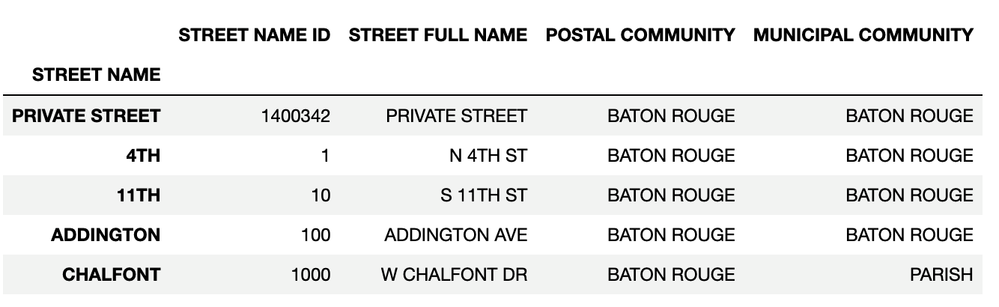

* The `iloc` method also allows us to select data, but instead of using labels, it uses integer-based indexing for selection by position. In other words, it selects data like one would select data from within a list: it uses a numeric index.

* The typical way in which data is called using both `loc` and `iloc` is by using a pair of brackets which contain the rows desired, followed by a comma, as the following code shows:

  ```python
  # Get the data contained within the "ADDINGTON" row and the "STREET FULL NAME" column
  addington_name = df.loc["ADDINGTON", "STREET FULL NAME"]
  print("Using loc: " + addington_name)

  also_addington_name = df.iloc[3, 1]
  print("Using iloc: " + also_addington_name)
  ```

  * The result is the same with either method:

    ```text
    Using loc: ADDINGTON AVE
    Using iloc: ADDINGTON AVE
    ```

* It is also possible to select a range of data using `loc` and `iloc` by passing in parameters for the rows and columns we desire.

* When using `loc`, we pass in the rows within brackets, then we pass in the columns within brackets as the following code shows:

  ```python
  # Get the first five rows of data and the columns from "STREET NAME ID" to "POSTAL COMMUNITY"
  # The problem with using "STREET NAME" as the index is that the values are not unique so duplicates are returned
  # If there are duplicates and loc is being used, Pandas will return an error
  private_to_chalfont = df.loc[["PRIVATE STREET", "4TH", "11TH", "ADDINGTON",
                                "CHALFONT"], ["STREET NAME ID", "STREET FULL NAME", "POSTAL COMMUNITY"]]
  print(private_to_chalfont)
  ```

* When using `iloc`, we pass in the rows and the columns using list indexing to tell Pandas to search for a range, as the following code shows:

  ```python
  # Using iloc will not find duplicates since a numeric index is always unique.
  also_private_to_chalfont = df.iloc[0:5, 0:3]
  print(also_private_to_chalfont)
  ```

* In the example we are selecting the same rows and columns, the difference between `loc` and `iloc` is that `iloc` only finds unique values for each row as the following image shows:

  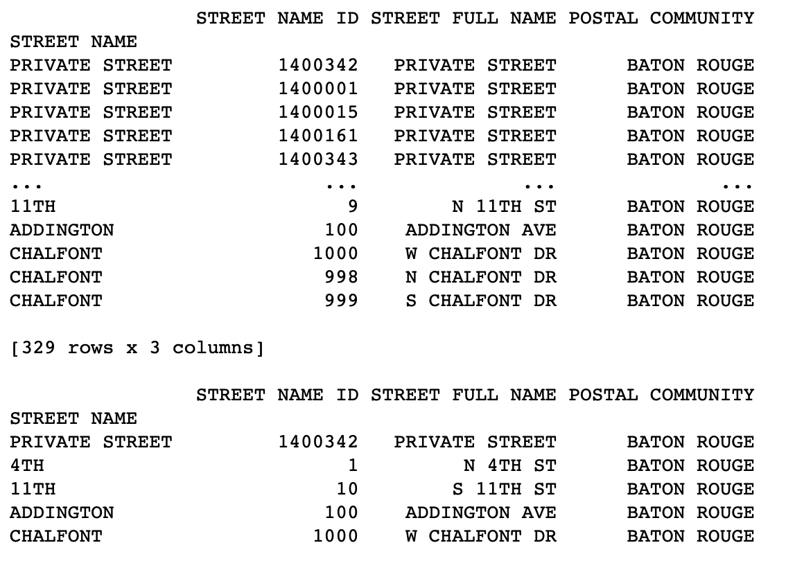

* We can also select all the rows of specific columns by passing in a colon instead of specific rows or a range. Then, we can select the columns as the following code shows:

  ```python
  # Using loc to select all rows for specific for the `STREET FULL NAME` and `POSTAL COMMUNITY` columns.
  df.loc[:, ["STREET FULL NAME", "POSTAL COMMUNITY"]].head()

  # Using iloc to select all rows for the second and third columns.
  df.iloc[:, 1:3].head()
  ```

  * The following image shows that both methods return the same data:

    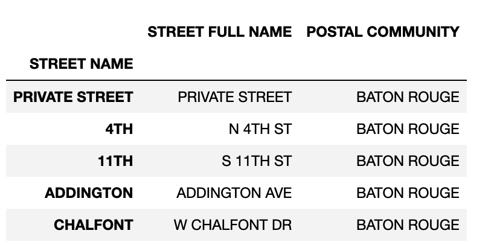

* Another exciting feature of `loc` and `iloc` is that these methods can be used to conditionally filter rows of data based on the values contained within a column.

  * We can conditionally filter rows of data by calling `loc` or `iloc` on a DataFrame and passing a logic test in place of the rows section of the call. For example, `loc[df["id"] >= 10, :]` will return all rows of data from the "id" column that have a value greater than or equal to 10.

  * It’s then possible to select which columns to return simply by adding their references into the columns section of the `loc` or `iloc` expression as the following code shows:

    ```python
    # loc will allow for conditional statements to filter rows of data
    # Using loc on the logic test above only returns rows where the result is True
    only_prairieville = df.loc[df["POSTAL COMMUNITY"] == "PRAIRIEVILLE", :]
    print(only_prairieville)

    # iloc will also allow for conditional statements to filter rows of data
    # Using iloc on the logic test above only returns rows where the result is True
    also_only_prairieville = df[df.iloc[:,2] == "PRAIRIEVILLE"]
    print(also_only_prairieville)
    ```

  * Before moving on, point out the differences in syntax when using `loc` versus `iloc`.


  * If multiple conditions should be checked, `&` and `|` may also be added into the logic test to represent `and` and `or`, respectively, which allows for a great amount of customization, as the following code shows:

    ```python
    # Multiple conditions can be set to narrow down or widen the filter
    only_prairieville_and_jackson = df.loc[(df["POSTAL COMMUNITY"] == "PRAIRIEVILLE") | (
        df["POSTAL COMMUNITY"] == "JACKSON"), :]
    print(only_prairieville_and_jackson)
    ```

Data Source: [City Parish Planning Commission (2021)](https://data.brla.gov/Transportation-and-Infrastructure/Street-Names/whw6-pbh2), modified in Pandas.

---

### 3. Students Do: Good Movies (20 min)

**Corresponding Activity:** [02-Stu_GoodMovies_Loc](Activities/02-Stu_GoodMovies_Loc/)

Continue through the slideshow, using the next slides as an accompaniment to this activity.

---

### 4. Review: Good Movies (5 min)

Open and share [good_movies_solution.ipynb](Activities/02-Stu_GoodMovies_Loc/Solved/good_movies_solution.ipynb), then go through the code with the class, answering any questions that students may have.

Cover the following key points during your review:

* Since the user is only interested in data that pertains to IMDb, all rows that contain non-IMDb review information are filtered out manually by simply dropping those rows.

* To collect only the films with a score greater than or equal to 7, a conditional `loc` filter is used that looks into the "IMDB" column and only collects those rows that pass through the logic test with a True value.

* In order to collect those films that have fewer than 20K votes, another conditional `loc` filter is used that searches through the "IMDB_user_vote_count" column and only collects those rows that pass through the logic test with a True value.

* The following image captures the code and outputs for this activity:

  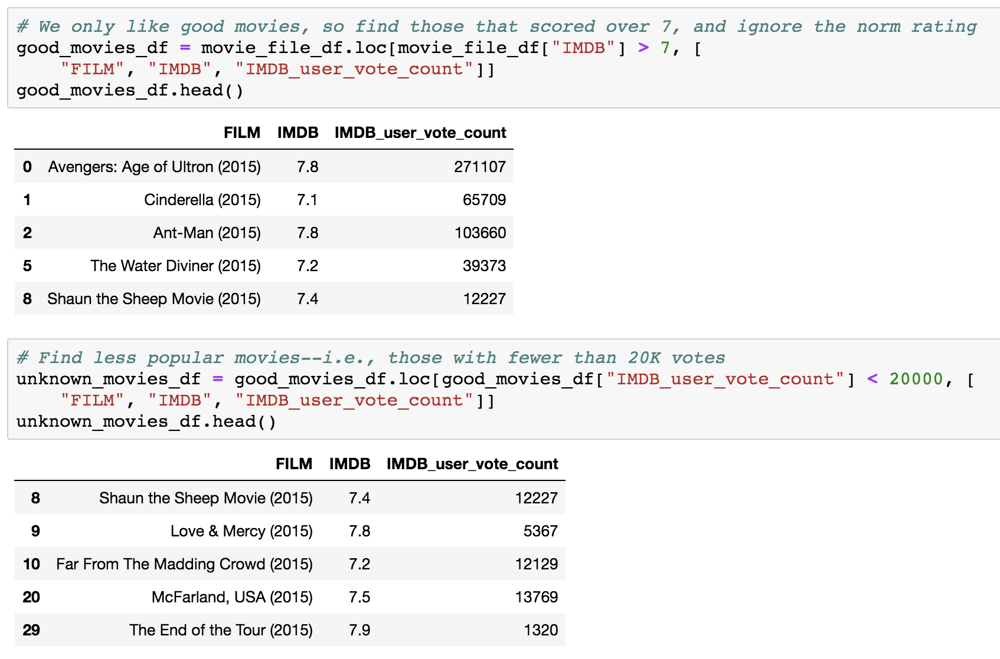

Data Source: Willison, S. (2020). [Fivethirtyeight](https://fivethirtyeight.datasettes.com/fivethirtyeight)

---

### 5. Instructor Do: Cleaning Data (5 min)

**Corresponding Activity:** [03-Ins_Cleaning_Data](Activities/03-Ins_Cleaning_Data)

Continue stepping through the slideshow, while you cover the following talking points:

When dealing with massive datasets, it’s almost inevitable that we’ll encounter duplicate rows, inconsistent spelling, and missing values.

* Although these issues may seem insignificant in the grand scheme, they can severely hinder the analysis and visualization of a dataset by skewing the data one way or another.

* Thankfully, Pandas includes methods for removing missing values, replacing duplicates, and changing values with relative ease.

* Open [cleaning_data_solution.ipynb](Activities/03-Ins_Cleaning_Data/Solved/cleaning_data_solution.ipynb) within Jupyter notebook, share the file, and run and discuss the code line by line with the class.

  * To delete a column of extraneous information from a DataFrame, use `del <DataFrame>[<Column>]`.

  * To figure out if any rows are missing data, simply run the `count()` method on the DataFrame and check that all columns contain equal values.

  * To drop rows with missing information from a DataFrame, use `<DataFrame>.dropna(how="any")`, as in the following image:

    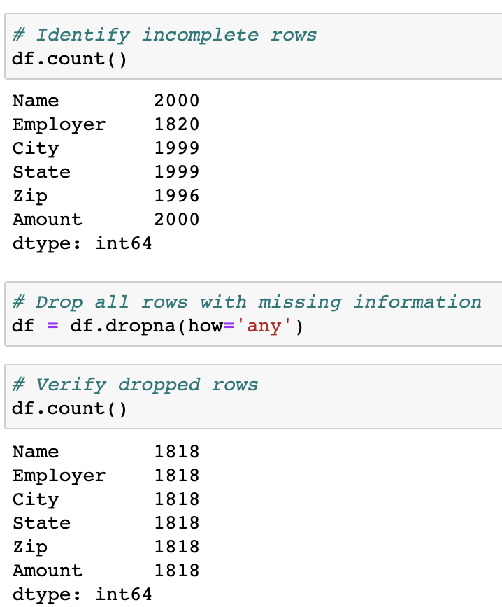

  * Sometimes, the rows containing "NaN" values should not be removed but should instead be filled with another value. In such cases, simply use the `<DataFrame>.fillna(value=<Value>)` method and pass the desired value into the parentheses.

  * To find similar or misspelled values, simply run the `value_counts()` method on the column in question and check the returned values.

  * To replace similar or misspelled values, simply run the `replace()` method on the column in question, and pass in a dictionary with the keys as the values to replace and the values as the replacements, as in the following image:

    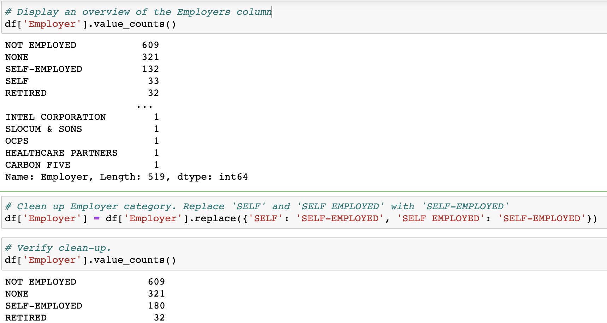

Data Source: Federal Election Commission (2021). Contributions by individuals, 2021-2022. [Federal Election Commission](https://www.fec.gov/data/browse-data/?tab=bulk-data), extracted, reduced, and modified in Pandas.

---

### 6. Partners Do: Hong Kong LPG Appliances - Cleaning Data (20 min)

**Corresponding Activity:** [04-Par_Cleaning_Appliance_Data](Activities/04-Par_Cleaning_Appliance_Data/)

Continue through the slideshow, using the next slides as an accompaniment to this activity.

The students will now take an LPG appliance dataset from Hong Kong, and do their best to clean it up so that the DataFrame is consistent and no rows are missing data.

---

### 7. Review: Hong Kong LPG Appliances (5 min)

Open [Hong_Kong_LPG_solution.ipynb](Activities/04-Par_Cleaning_Appliance_Data/Solved/Hong_Kong_LPG_solution.ipynb) within Jupyter notebook, and briefly go over the solution with the students while answering any questions.

Data Source: Hong Kong Electrical and Mechanical Services Department via [data.gov.hk](https://data.gov.hk) (2022). Approved List of [Domestic Gas Appliances (LP Gas)](https://data.gov.hk/en-data/dataset/hk-emsd-emsd1-domestic-gas-appliances-lpg)

---

### 8. Everyone Do: Pandas Recap and Data Types (15 min)

**Corresponding Activity:** [05-Evr_Pandas_Recap](Activities/05-Evr_Pandas_Recap/)

Continue stepping through the slideshow, while you cover the following talking points for this section:

This activity will recap what we have covered in Pandas up to this point.

Open [Pandas_recap.ipynb](Activities/05-Evr_Pandas_Recap/Unsolved/Pandas_recap.ipynb) along with [CT_fires_2015.csv](Activities/05-Evr_Pandas_Recap/Unsolved/Resources/CT_fires_2015.csv).

* Go through the cells within the unsolved version of the Jupyter notebook, and have the class help you create the code to accomplish the tasks listed within the comments.

* If the students seem to be struggling, feel free to refer to [Pandas_recap_solution.ipynb](Activities/05-Evr_Pandas_Recap/Solved/Pandas_recap_solution.ipynb) to help keep the class on track.

* Upon reaching the final section, let the class know that this DataFrame has a small problem: The date and time columns are being stored as objects.

* A list of a DataFrame's data types can be checked by accessing its `dtypes` property, as captured in the following image:

  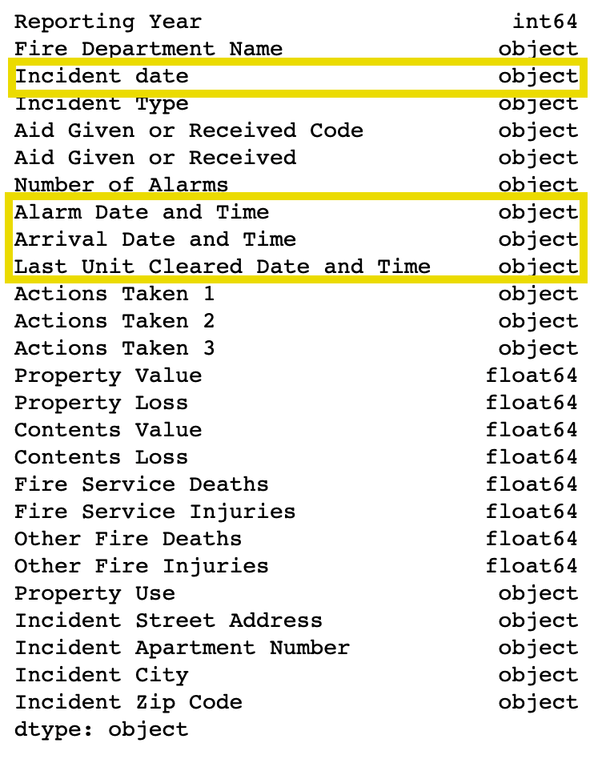

* With the date columns stored as objects, it is currently impossible to perform any form of calculation on any columns with date data. Luckily, Pandas includes a way to easily change a column's data type.

* To change a non-numeric column to a numeric column, use the `df.astype` method and pass in the desired data type as the parameter as the following code shows:

  ```python
  # Convert relevant date columns to datetime
  loss_df = loss_df.astype({"Alarm Date and Time": "datetime64",
                          "Arrival Date and Time": "datetime64",
                          "Last Unit Cleared Date and Time": "datetime64"})
  loss_df.dtypes
  ```

Data Source: [National Fire Incident Reporting System (NFIRS). Connecticut Fire Department Incidents (2012-2016)](https://data.ct.gov/Public-Safety/Connecticut-Fire-Department-Incidents-2012-2016-/qem9-rt8k), reduced in Pandas.

---

### 9.  BREAK (15 min)

---

### 10. Instructor Do: Pandas Grouping (10 min)

**Corresponding Activity:** [06-Ins_GroupBy](Activities/06-Ins_GroupBy)

Continue stepping through the slideshow, while you cover the following talking points:

* In the last activity, the class created a DataFrame that contained the sum of loss incidents in each city. This acted as a summary table but does not include other interesting data points. For example, it does not contain the total monetary value of property and contents loss for each city.

* Although it would be possible to collect and calculate the sum of property and contents loss for each city through ample use of `loc` filtering, the `groupby` method is a much simpler and time-effective approach.

* Open [groupby_solution.ipynb](Activities/06-Ins_GroupBy/Solved/groupby_solution.ipynb) in Jupyter notebook, and go through the code with the class, explaining it cell by cell.

  * The start of the code is much the same as earlier. Import in dependencies, select the columns we want, fix NA values, convert the date columns to `datetime`, calculate the response time and duration, filter the DataFrame so that it shows only incidents of loss information, and count the number of incidents per state.

  * The `df.groupby([<Columns>])` method is then used to split the DataFrame into multiple groups, with each group being a different city within Connecticut.

  * The object returned by the `groupby` method is a GroupBy object, and it cannot be accessed like a normal DataFrame. In fact, one of the only ways to access values within a GroupBy object is to use a data function on it, as in the following image:

    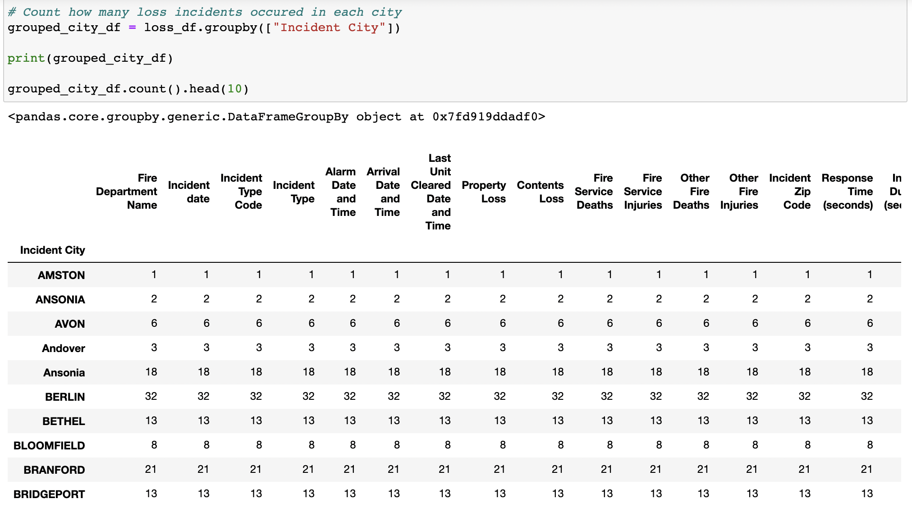

  * We can create new DataFrames using purely GroupBy data by taking the `pd.DataFrame()` method and passing the desired GroupBy data in as the parameter.

  * A DataFrame can also be created by selecting a single Series from a GroupBy object and passing it in as the values for a specified column, as in the following code and image show:

    ```python
    # Count how many loss incidents occurred in each city
    grouped_city_df = loss_df.groupby(["Incident City"])

    print(grouped_city_df)

    grouped_city_df.count().head(10)
    ```


      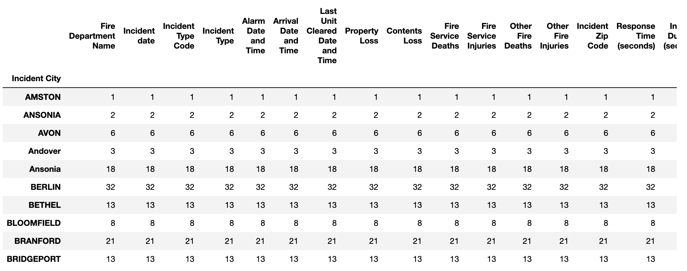

  * It is also possible to perform a `df.groupby()` method on multiple columns by simply passing two or more column references into the list parameter, as the following code and image show:

    ```python
    # This returns an object with multiple indexes, however, which can be harder to deal with
    grouped_city_loss_incidents = loss_df.groupby(["Incident City","Incident Type Code"])

    grouped_city_loss_incidents.count().head(10)
    ```

      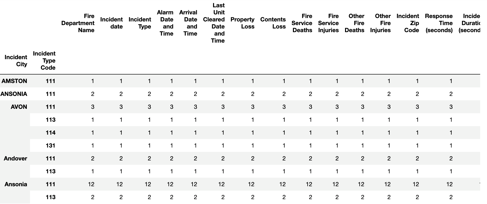

  * A new DataFrame can be created from a GroupBy object, as follows:

    ```python
      # Converting a GroupBy object into a DataFrame
      total_city_loss_df = pd.DataFrame(
        grouped_city_loss_incidents[["Property Loss", "Contents Loss"]].sum())
      total_city_loss_df.head(10)
    ```

      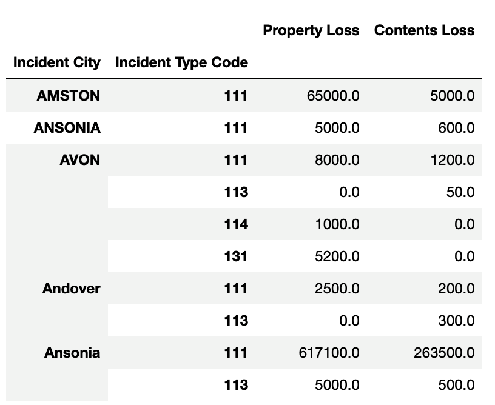

  * We can also other aggregation functions besides the `sum` function on a GroupBy object, like the `mean` function as follows:

    ```python
    # GroupBy is also useful for situations where you may want to calculate the average
    incident_time_df = converted_fires_df[["Incident City","Response Time (seconds)", "Incident Duration (seconds)"]]
    incident_time_df.groupby(["Incident City"]).mean().head(10)
    ```

    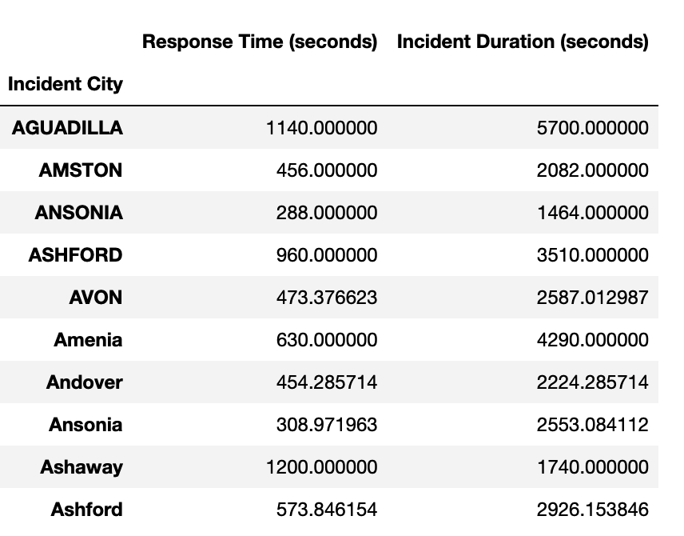

Encourage the students to explore this dataset further on their own and to apply what they have learned in this demonstration to other columns.

Data Source: [National Fire Incident Reporting System (NFIRS). Connecticut Fire Department Incidents (2012-2016)](https://data.ct.gov/Public-Safety/Connecticut-Fire-Department-Incidents-2012-2016-/qem9-rt8k), reduced in Pandas

---

### 11. Partners Do: Exploring U.S. Census Data with GroupBy (25 min)

**Corresponding Activity:** [07-Par_Census_GroupBy](Activities/07-Par_Census_GroupBy/)

Continue through the slideshow, using the next slides as an accompaniment to this activity.

Students will now take some time to create two DataFrames that contain calculations made by using U.S. Census data. They will do so by using the `groupby` method and then converting their findings into DataFrames.

---

### 12. Review: Exploring U.S. Census Data with GroupBy (10 min)

Open the solved version of [census_groupby_solution.ipynb](Activities/07-Par_Census_GroupBy/Solved/census_groupby_solution.ipynb) within Jupyter notebook, send the file to students, and work through the code with the class, making sure to cover the following points:

* The original dataset is read into a Pandas DataFrame and then used to create a DataFrame as follows with columns that we can aggregate:

  ```python
  # Create a DataFrame with columns to total: Year, County, State, Population,
  # Employed Civilians, Unemployed Civilians, People in the Military, Poverty Count
  census_totals_df = census_df[["Year", "County", "State", "Population",
                                "Employed Civilians", "Unemployed Civilians",
                                "People in the Military", "Poverty Count"]]
  census_totals_df.head()
  ```

  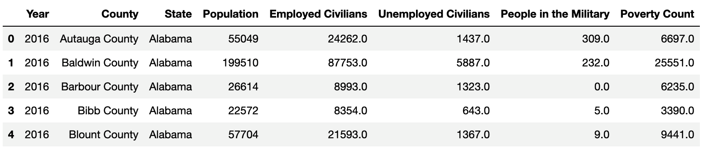

* Next, we can group by the "Year" and "State" columns and calculate the totals as follows:

  ```python
  # Create a DataFrame of the totals for each state by year.
  census_total_group = census_totals_df.groupby(["Year", "State"])

  state_totals_df = census_total_group.sum()
  state_totals_df
  ```

    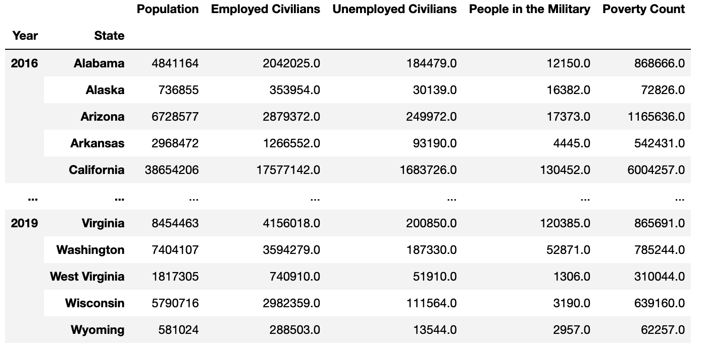

* After we rename the columns we create a new DataFrame so we can get the calculate the averages by "Year" and "State" as follows:

  ```python
  # Create a DataFrame with columns to average: Year, County, State, Median Age,
  # Household Income, Per Capita Income
  census_avg_df = census_df[["Year", "County", "State", "Median Age",
                            "Household Income", "Per Capita Income"]]
  census_avg_df.head()

  # Create a DataFrame of the averages for each state by year.
  census_avg_group = census_avg_df.groupby(["Year", "State"])

  state_avg_df = census_avg_group.mean()
  state_avg_df
  ```

  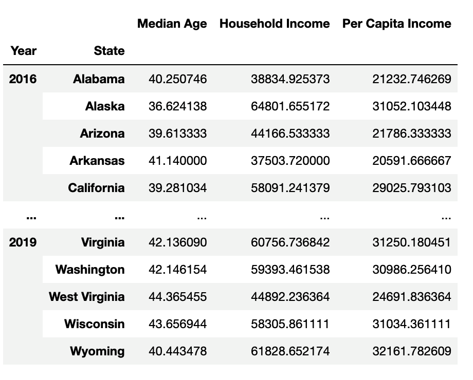

* Finally, we rename the columns so they are more coherent and then export the final DataFrames as a CSV files as follows:

  ```python
  # Rename columns to make them more coherent.
  state_avg_df = state_avg_df.rename(columns={"Median Age": "Average Median Age by County",
                                              "Household Income": "Average Household Income by County",
                                              "Per Capita Income": "Average Per Capita Income by County"})
  state_avg_df

  # Export the DataFrames to CSV
  state_totals_df.to_csv("output/state_totals.csv", index=True)
  state_avg_df.to_csv("output/state_avg.csv", index=True)
  ```

Answer any questions that the class may have before moving on to the next activity.

Data Source: [U.S. Census API - ACS 5-Year Estimates 2016-2019](https://www.census.gov/data/developers/data-sets/census-microdata-api.ACS_5-Year_PUMS.html)

---

### 13. Instructor Do: Sorting Made Easy (10 min)

**Corresponding Activity:** [08-Ins_Sorting](Activities/08-Ins_Sorting)

Continue through the slideshow, using the next slides as an accompaniment to this activity.

Open [sorting_data_solution.ipynb](Activities/08-Ins_Sorting/Solved/sorting_data_solution.ipynb) within Jupyter notebook, send the file to students, and go through the code with the class, discussing it cell by cell as you cover the following talking points:

* It’s possible to sort the Vermont meals and rooms tax statistics data by using the values in different columns.

* To sort a DataFrame based on the values within a column, simply use the `df.sort_values` method and pass in the column name to sort by as a parameter.

  ```python
  # Sorting the DataFrame based on "Meals" column
  # Will sort from lowest to highest if no other parameter is passed
  meals_taxes_df = taxes_df.sort_values("Meals")
  meals_taxes_df.head()
  ```

* The "ascending" parameter is always marked as `True` by default. Therefore, the `sort_values` method will always sort from lowest to highest unless the parameter of `ascending=False` is also passed into the `sort_values` method:

  ```python
  # To sort from highest to lowest, ascending=False must be passed in
  meals_taxes_df = taxes_df.sort_values("Meals", ascending=False)
  meals_taxes_df.head()
  ```

* It’s also possible to sort the data based on values stored within multiple columns by passing a list of columns into the `sort_values` method as a parameter. The first column will be the primary sorting method, while the second column determines the row order when the first column has multiple rows with the same value.

  ```python
  # It is possible to sort based upon multiple columns
  meals_and_rent_count_df = taxes_df.sort_values(
      ["Meals Count", "Rent Count"], ascending=False)
  meals_and_rent_count_df.head(15)
  ```

  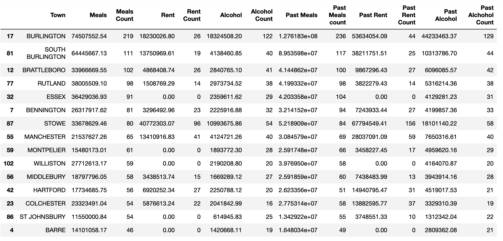

* This can be demonstrated by sorting on a different second column, "Alcohol Count", and comparing the order of the two rows where "Meals Count" has a value of "54" in each DataFrames.

  ```python
  # DataFrame with a second column sort on "Alcohol Count"
  # (Compare the order of the two "54" value Rent Count rows)
  meals_and_alcohol_count_df = taxes_df.sort_values(
      ["Meals Count", "Alcohol Count"], ascending=False)
  meals_and_alcohol_count_df.head(15)
  ```

  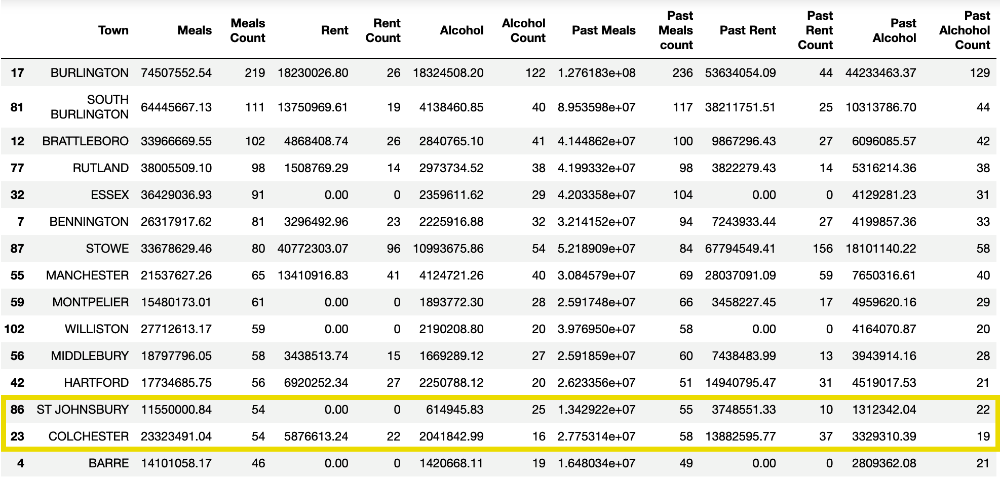


* An immensely helpful method when dealing with sorted DataFrames is the `df.reset_index` method. This method will recalculate the index for each row based on its position within the new DataFrame, and it will, therefore, allow for simpler row referencing in the future.

* Passing `drop=True` into `df.reset_index()` will ensure that no new column is created when the index is reset as follows:

  ```python
  # The index can be reset to provide index numbers based on the new rankings.
  new_index_df = meals_and_alcohol_count_df.reset_index(drop=True)
  new_index_df.head()
  ```


Data Source: [Vermont Agency of Administration, Department of Taxes. Meals and Rooms Tax Statistics (2020 Multiple Periods Update, Calendar Year)](https://tax.vermont.gov/data-and-statistics/mrt)

---

### 14. Students Do: Search for the Worst (20 min)

**Corresponding Activity:** [09-Stu_SearchForTheWorst](Activities/09-Stu_SearchForTheWorst/)

Continue through the slideshow, using the next slides as an accompaniment to this activity.

The students will now use a dataset on San Francisco Airports' utility consumption to determine which month had the worst consumption for each utility.

---

### 15. Review: Search For the Worst (5 min)

Open [search_for_the_worst_solution.ipynb](Activities/09-Stu_SearchForTheWorst/Solved/search_for_the_worst_solution.ipynb) within Jupyter notebook, and go through the code with the class, discussing it cell by cell.

* To collect a list of all the utilities in the dataset, the `unique()` method is run on the "Utility" column within the DataFrame.

  ```python
  # Collect a list of all the unique values in "Utility"
  consumption_df["Utility"].unique()
  ```

* To filter on a particular utility and owner, use `df.loc` and have it collect only those rows where "Utility" is equal to "Electricity" and "Owner" is equal to "Tenant" as follows:

  ```python
  # Looking only at Electricity Consumption with "Tenant" owner
  electricity_df = consumption_df.loc[(consumption_df["Utility"] == "Electricity") &
                                      (consumption_df["Owner"] == "Tenant"), :]
  electricity_df.head()
  ```


* To sort the values within the new DataFrame from highest to lowest, we use the `sort_values` method and pass in the "Usage" column, and sort in descending order using `ascending=False`. Then, we reset the index and no new column is created as follows:

  ```python
  # Sort the DataFrame by the values in the "Usage" column to find the worst month
  electricity_df = electricity_df.sort_values(by="Usage", ascending=False)

  # Reset the index so that the index is now based on the sorting locations
  electricity_df = electricity_df.reset_index(drop=True)

  electricity_df.head()
  ```

* The final DataFrame is as follows:

  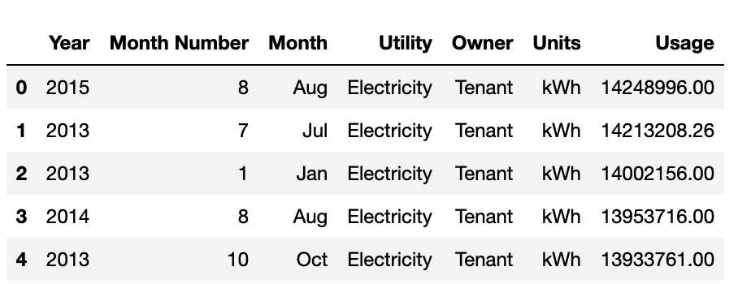

* Finally, we get the worst month for electricity consumption using the `iloc` method on the `electricity_df` DataFrame as follows:

  ```python
  # Save all of the information collected on the worst month
  worst_month = electricity_df.iloc[0, :]
  worst_month
  ```

  ```text
  Year                   2015
  Month Number              8
  Month                   Aug
  Utility         Electricity
  Owner                Tenant
  Units                   kWh
  Usage            14248996.0
  Name: 0, dtype: object
  ```

Data Source: [SFO Airport Monthly Utility Consumption for Natural Gas, Water, and Electricity](https://data.sfgov.org/Energy-and-Environment/SFO-Airport-Monthly-Utility-Consumption-for-Natura/gcjv-3mzf)

---

© 2022 edX Boot Camps LLC. Confidential and Proprietary. All Rights Reserved.
