## 4.3 Merging and Data Cleaning

### Overview

Today's lesson is split into two parts. The first part will test the Pandas skills of the class by having them identify and fix buggy code so it functions properly. In the second part, the students will use all the tools they have developed this week to understand the concept of programmatically manipulating data.

### Class Objectives

By the end of this lesson, the students will be able to:

* Merge DataFrames and distinguish between inner, outer, left, and right merges.

* Slice data by using the `cut()` method, and create new values based on a series of bins.

* Fix common Python/Pandas bugs in Jupyter notebook.

* Use Google to explore additional Pandas functionality as needed.

---

### Instructor Notes

* This class will contain minimal lecture time. In fact, most of the day will be taken up with large-scale activities that will test the skill and problem-solving abilities of the students. It is critical that everyone on the instructional team is ready to assist students whenever a bug or question arises.

* Some questions or code blocks will baffle even the most experienced Pandas programmers. Therefore, it may be wise to keep a laptop with solved activity code loaded and ready. This way, whenever a student gets stuck, the instructional team will have a reference ready to help fix the problem.

---

### Class Slides

* The slides for this lesson can be viewed on Google Drive here: [Lesson 4.3 slides](https://docs.google.com/presentation/d/1LbIbYi8LHXXGTzatXztB92kMRBR0kYbFR8QLO7orWkQ/edit?usp=sharing).

* To add the slides to the student-facing repository, download the slides as a PDF by navigating to File, selecting "Download as," and then choosing "PDF document." Then, add the PDF file to your class repository along with other necessary files. You can view instructions for this [here](https://docs.google.com/document/d/1XM90c4s9XjwZHjdUlwEMcv2iXcO_yRGx5p2iLZ3BGNI/edit?usp=sharing).

* **Note:** Editing access is not available for this document. If you wish to modify the slides, create a copy by navigating to File and selecting "Make a copy...".

---

### Time Tracker

| Start Time | Number | Activity                                           | Duration |
| ---------- | ------ | -------------------------------------------------- | -------- |
| 6:30 PM    | 1      | Instructor Do: Welcome Class                       | 0:05     |
| 6:35 PM    | 2      | Instructor Do: Merging DataFrames                  | 0:10     |
| 6:45 PM    | 3      | Students Do: Census Merging                        | 0:15     |
| 7:00 PM    | 4      | Review: Census Merging                             | 0:10     |
| 7:10 PM    | 5      | Instructor Do: Binning Data                        | 0:10     |
| 7:20 PM    | 6      | Students Do: Binning Movies                        | 0:25     |
| 7:45 PM    | 7      | Review: Binning Movies                             | 0:05     |
| 7:50 PM    | 8      | Instructor Do: Mapping                             | 0:10     |
| 8:00 PM    | 9      | Everyone Do: Crowdfunding Cleaning                 | 0:30     |
| 8:30 PM    | 10     | BREAK                                              | 0:15     |
| 8:45 PM    | 11     | Instructor Do: Introduction to Bug Fixing          | 0:10     |
| 8:55 PM    | 12     | Everyone Do: Bug Fixing Bonanza                    | 0:35     |
| 9:30 PM    |        | END                                                |          |

---

### 1. Instructor Do: Welcome Class (5 min)

Open the slides, and use the first few slides to welcome the class and introduce today's lesson. Cover the following points:

Welcome the class, and let them know that today we will delve into a few more functions in the Pandas library. We will also learn how to deal with multiple datasets. The end of the lesson will focus more on teaching the students how to teach themselves and fix bugs.

* Although this concept may sound strange to the class at first, let them know that self-teaching is probably the most important skill in the programmer’s toolkit because languages are never set in stone.

* New libraries are always being developed, and even core programming languages are regularly updated to include new functions or syntax. As such, proficient programmers must always be ready and willing to teach themselves new skills.

* If the students seem nervous, reassure them that self-teaching becomes much easier as time goes by. The students may already be practicing this skill without realizing it because the best way to learn new techniques is to make mistakes and look up solutions online.

---

### 2. Instructor Do: Merging DataFrames (10 min)

**Corresponding Activity:** [01-Ins_Merging](Activities/01-Ins_Merging)

Continue stepping through the slideshow, while you cover the following talking points:

Analysts are often provided data that is split into multiple parts. Of course, working with a bunch of different datasets is less than ideal.

Thankfully, Pandas allows its users to easily combine, or **merge**, separate DataFrames on similar values using the `merge` method.

Open [merging_solution.ipynb](Activities/01-Ins_Merging/Solved/merging_solution.ipynb) within Jupyter notebook, share the file with students, and go through the code with the class, discussing it cell by cell.

* The first chunks of code are used to create two DataFrames that contain information on customers and the purchases they’ve made.

* Point out that these two DataFrames share the "customer_id" column. This will be very important soon.

* In the final chunk of code, the `merge` method is used, and three parameters are passed into it, the two DataFrames and the column to merge the DataFrames as the code shows:

  ```python
  # Merge two DataFrame using an inner join
  merge_df = pd.merge(info_df, items_df, on="customer_id")
  merge_df
  ```

* This code tells the computer to combine the two DataFrames so that whenever the "customer_id" column matches, the rows containing the matching data are joined, as captured in the following image:

  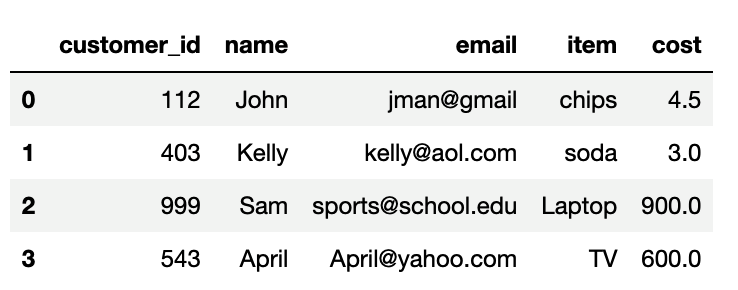

* This is known as an **inner join**. Inner joins are the default means for combining DataFrames using the `merge()` method. They will only return data whose values match. Any rows that do not include matching data will be dropped from the combined DataFrame.

* The opposite of an inner join is an **outer join**. Outer joins will combine the DataFrames whether or not any of the rows match. Outer joins must be declared as a parameter within the `merge` method using the syntax `how="outer"`, as the code shows:

  ```python
  # Merge two DataFrames using an outer join
  merge_df = pd.merge(info_df, items_df, on="customer_id", how="outer")
  merge_df
  ```

  * The outer merge output:

    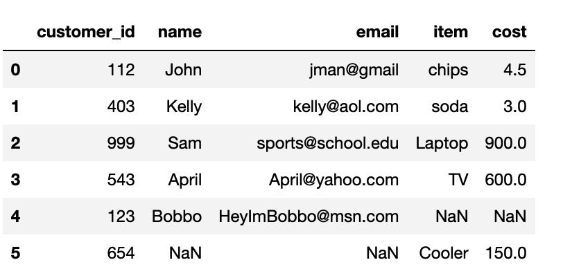

* Any rows that do not include matching data will have the values within replaced with `NaN`.

* There are also **right joins** and **left joins**. These joins will protect the data contained within one DataFrame, like an outer join does, while also dropping the rows with null data from the other DataFrame, as captured in the following image:

  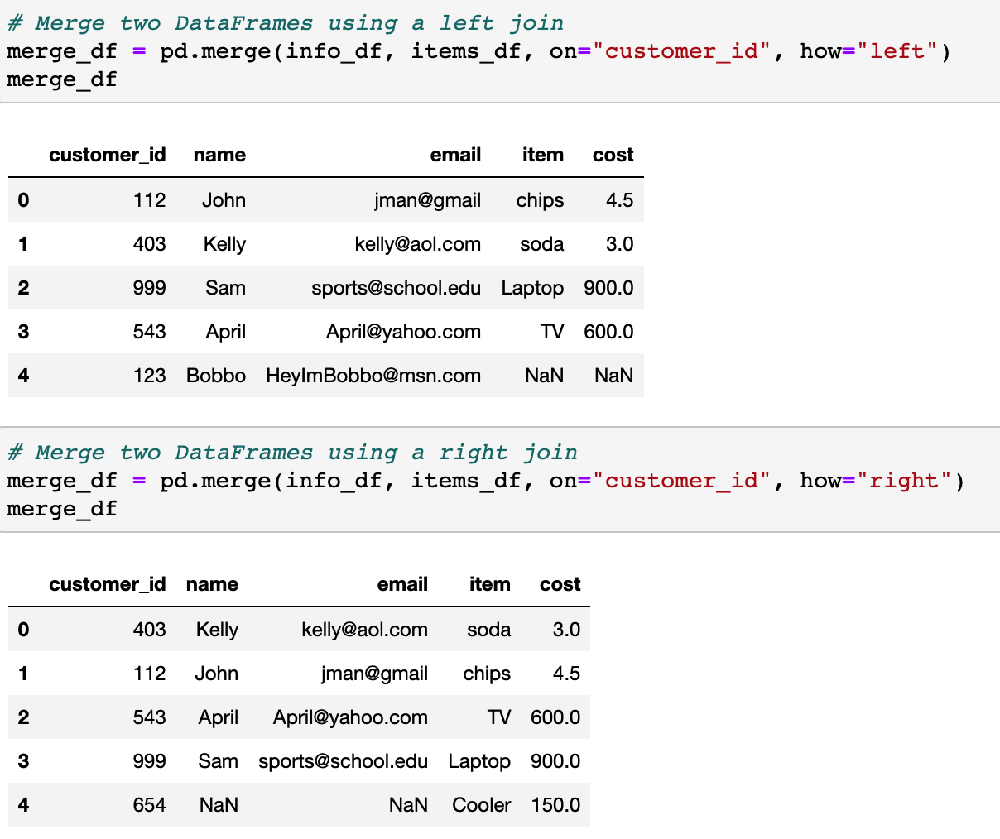

Data Source: Data for this dataset was generated by edX Boot Camps LLC, and is intended for educational purposes only.

---

### 3. Students Do: Census Merging (15 min)

**Corresponding Activity:** [02-Stu_Census_Merging](Activities/02-Stu_Census_Merging/)

Continue through the slideshow, using the next slides as an accompaniment to this activity.

The students will now take a moment to merge the two census datasets they created in the previous class.

---

### 4. Review: Census Merging (10 min)

Open [census_merging_solution.ipynb](Activities/02-Stu_Census_Merging/Solved/census_merging_solution.ipynb) in Jupyter notebook, send out the file, and go through the code with the class, discussing it cell by cell.

Cover the following key points:

* Since we are merging on two columns, the columns must be in a list, as the following code shows:

  ```python
  # Merge the two DataFrames together based on the "Year" and "State" they share.
  census_df = pd.merge(state_avg_df, state_totals_df, on=["Year", "State"])
  census_df.head()
  ```

* We create a new DataFrame with 2019 data only as follows:

  ```python
  # Create a DataFrame that filters the data on only 2019
  census_2019_df = pd.DataFrame(census_df.loc[census_df["Year"]==2019,:])
  census_2019_df.head()
  ```

* Then, create a new column "Poverty Rate (%)" by dividing the "Total Population in Poverty" by the "Total Population" as follows:

  ```python
  # Add a new column that calculates the Poverty Rate
  census_2019_df["Poverty Rate (%)"] = census_2019_df["Total Population in Poverty"] / census_2019_df["Total Population"] * 100
  census_2019_df.head()
  ```

  * The following image shows the new column in our `census_2019_df` DataFrame:

    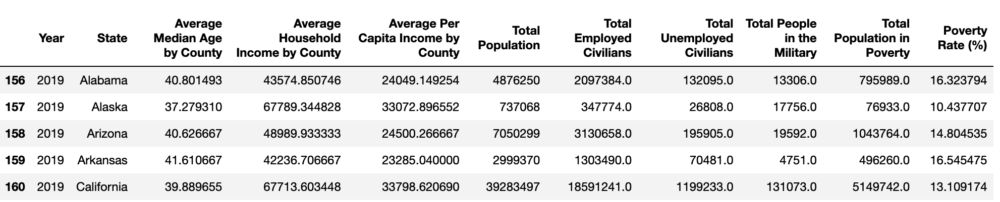

* Next, we sort the DataFrame in descending order on the "Poverty Rate (%)" and "Average Per Capita Income by County", and then reset the index as follows:

  ```python
  # Sort the data by Poverty Rate and Average Per Capita Income by County, Highest to Lowest
  poverty_sorted_df = census_2019_df.sort_values(["Poverty Rate (%)",
                                              "Average Per Capita Income by County"],
                                            ascending=False)

  # Reset Index
  poverty_sorted_df = poverty_sorted_df.reset_index(drop=True)
  poverty_sorted_df.head()
  ```

* Then, we use `loc[0. :]` to get the state with the highest poverty rate on the `poverty_sorted_df` DataFrame as follows:

  ```python
  # Print out the data for the state or territory with the highest poverty rate
  highest_poverty = poverty_sorted_df.loc[0, :]
  highest_poverty
  ```

* For the bonus, we use `poverty_sorted_df.loc[len(poverty_sorted_df)-1, :]` to find the state with the lowest poverty rate as captured in the following image:

  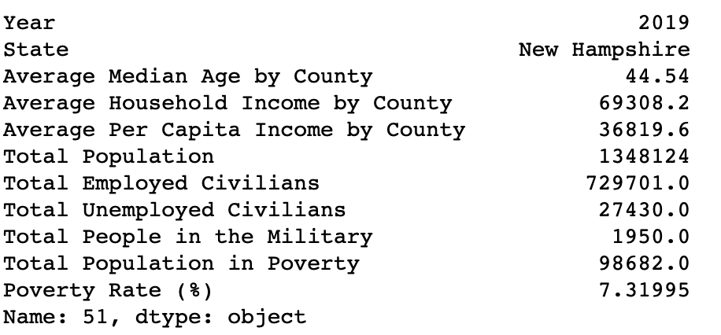

Data Source: [U.S. Census API - ACS 5-Year Estimates 2016-2019](https://www.census.gov/data/developers/data-sets/census-microdata-api.ACS_5-Year_PUMS.html)

---

### 5. Instructor Do: Binning Data (10 min)

**Corresponding Activity:** [03-Ins_Binning](Activities/03-Ins_Binning)

Continue stepping through the slideshow, while you cover the following talking points:

Not everyone is a "numbers person," and sometimes a DataFrame has so many values that it becomes extremely difficult to comprehend exactly what is going on. For this reason, Pandas has a built-in **binning** method that allows its users to place values into groups, which enables more vigorous dataset customization.

Open [binning_solution.ipynb](Activities/03-Ins_Binning/Solved/binning_solution.ipynb) in Jupyter notebook, share the file, and go through the code with the class, discussing it cell by cell.

Cover the following points:

* When using the `cut()` function, three parameters must be passed in. The first is the Series that is going to be cut. The second is a list of cutoff values for the bins that the Series will be sliced into. The third is a list of the names or values that will be given to the bins.

* Pandas automatically creates the bin ranges from the list of cutoff values. It’s important to note that the first and last cutoff value will be the minimum of the first bin and maximum of the last bin, respectively. The other cutoff values will be shared by adjacent bins. (The default behavior of `cut()` function is to include the higher cutoff value in the bin).

* For `test_scores_df` DataFrame, we create bins and the names of the bins as follows:

  ```python
  # Create the bins in which Data will be held
  # Bins are 0, 59.9, 69.9, 79.9, 89.9, 100.
  bins = [0, 59.9, 69.9, 79.9, 89.9, 100]

  # Create the names for the five bins
  group_names = ["F", "D", "C", "B", "A"]
  ```

  * The bins will have the following cutoff values: (0, 59.9], (60, 69.9], (70, 79.9], (80, 89.9], (90, 100].

  * **Important:** The number of labels for the `cut()` method must equal the number of bins. If there are too many or too few, an error will be returned.

* Then, we add the names of the five bins in a new column, "Test Score Summary" where the `cut` function is applied as follows:

  ```python
  # Slice the data and place it into bins
  test_scores_df["Test Score Summary"] = pd.cut(test_scores_df["Test Score"], bins, labels=group_names, include_lowest=True)
  test_scores_df
  ```

  * The resulting DataFrame contains the original data plus the new column with the binned data as the following image shows:

    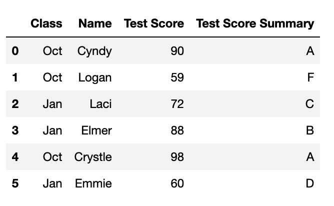

* Binning is so powerful because, after creating and applying these bins, the DataFrame can be grouped according to those values, and a higher-level analysis can be conducted, as shown in the following code an resulting output:

  ```python
  # Creating a group based off of the bins
  test_scores_df = test_scores_df.groupby("Test Score Summary")
  test_scores_df.max()
  ```

    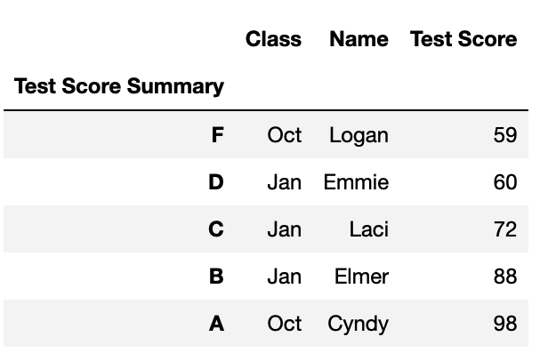

---

### 6. Students Do: Binning Movies (25 min)

**Corresponding Activity:** [04-Stu_MovieRatings_Binning](Activities/04-Stu_MovieRatings_Binning/)

Continue through the slideshow, using the next slides as an accompaniment to this activity.

The students will now put their binning skills to use by creating bins for movies based on their IMDd user vote count. After creating the bins, they will group the DataFrame based on those bins and then perform some analysis on them.

---

### 7. Review: Binning Movies (5 min)

Open [binning_movies_solution.ipynb](Activities/04-Stu_MovieRatings_Binning/Solved/binning_movies_solution.ipynb) in Jupyter notebook, share the file, and go through the code with the class, discussing it cell by cell.

* First, we get the minimum and maximum IMDB vote count with the following code:

  ```python
  # Figure out the minimum and maximum IMDB user vote count
  print(movies_df["IMDB_user_vote_count"].max())
  print(movies_df["IMDB_user_vote_count"].min())
  ```

* Since the values contained within the "IMDB user vote count" column are so widespread, there are several acceptable ways to split up the data. This particular code uses a variable scale so there are 12 to 19 rows in each group. This creates a graduated scale that starts with 2.5K user vote count ranges for the first two bins, scaling up to a 250K range for the final bin, as the following code shows:

  ```python
  # Create bins in which to place values based upon IMDB vote count
  bins = [0, 2499, 4999, 9999, 14999, 19999, 29999, 49999, 99999, 350000]

  # Create labels for these bins
  group_labels = ["0 to 2.4k", "2.5k to 4.9k", "5k to 9k", "10k to 14k", "15k to 19k", "20k to 29k",
                  "30k to 49k", "50k to 99k", "100k to 350k"]
  ```

* Then, we slice the `movies_df` DataFrame and place the vote count into bins as follows:

  ```python
  # Slice the data and place it into bins
  pd.cut(movies_df["IMDB_user_vote_count"], bins, labels=group_labels)
  ```

  * This produces the following output showing what bin each row will contain:

    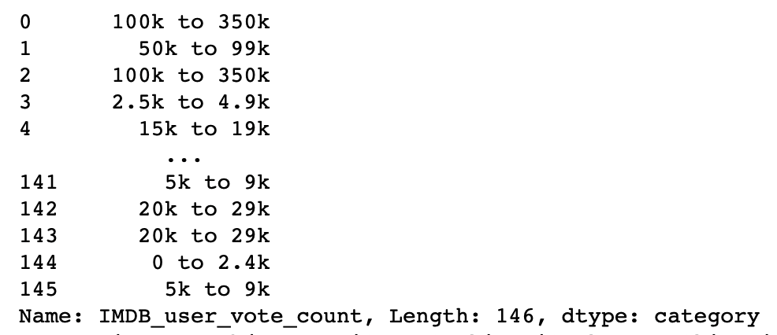

* The bins are added into the DataFrame by simply placing them within a new column. The DataFrame is then grouped on this new column to perform all of the data functions.

Data Source: [FiveThirtyEight (2015)](https://github.com/fivethirtyeight/data/tree/master/fandango)

---

### 8. Instructor Do: Mapping (10 min)

**Corresponding Activity:** [05-Ins_Mapping](Activities/05-Ins_Mapping)

Continue stepping through the slideshow, while you cover the following talking points:

Remind the students how Excel's number formats allow users to easily change the styling of columns. Pandas also includes this functionality with its `map()` method, which allows users to style entire columns at once.

Open [mapping_solution.ipynb](Activities/05-Ins_Mapping/Solved/mapping_solution.ipynb) in Jupyter notebook, share the file with the students, and go through the code with the class, discussing it cell by cell.

* `df[<COLUMN>].map(<FORMAT STRING>.format)` enables users to modify the styling of an entire column.

* The formatting syntax used for mapping is, in a word, confusing. It uses strings containing curly brackets to determine how to style columns, and this can make it difficult to understand at first.

* A somewhat easy way to understand mapping strings is that it is fairly similar to concatenating strings. Whatever is outside of the curly brackets is added before or after the initial value, which is modified by whatever is contained within the curly brackets.

* So, to convert values into a typical dollar format, one would use `"${:.2f}"`. This places a dollar sign before the value, which has been rounded to two decimal places.

* Using `"{:,}"` will split a number up so that it uses comma notation. For example, the value `2000` would become `2,000` using this format string, as the following code shows:

  ```python
  # Use Map to format all the columns
  file_df["INCOME"] = file_df["INCOME"].map("${:,.2f}".format)
  file_df["COSTS"] = file_df["COSTS"].map("${:,.2f}".format)
  file_df["PERCENT30"] = (file_df["PERCENT30"]*100).map("{:.1f}%".format)
  file_df["PERCENT3050"] = (file_df["PERCENT3050"]*100).map("{:.1f}%".format)
  file_df["PERCENT50"] = (file_df["PERCENT50"]*100).map("{:.1f}%".format)
  file_df["PERCENT_NODATA"] = (file_df["PERCENT_NODATA"]*100).map("{:.1f}%".format)
  file_df["PERCENT_NOBURDEN"] = (file_df["PERCENT_NOBURDEN"]*100).map("{:.1f}%".format)
  file_df["TOTAL"] = file_df["TOTAL"].map("{:,}".format)
  file_df.head()
  ```

* Format mapping really works only once; it will return errors if the same code is run multiple times without restarting the kernel. Therefore, formatting is usually applied near the end of an application.

* Note also that it will format `NaN` values, so it is a good idea to run a `.fillna()` or `.dropna()` to avoid formatting null values.

* Format mapping also can change the data type of a column, as captured in the following image, so all calculations should be handled before modifying the formatting.

  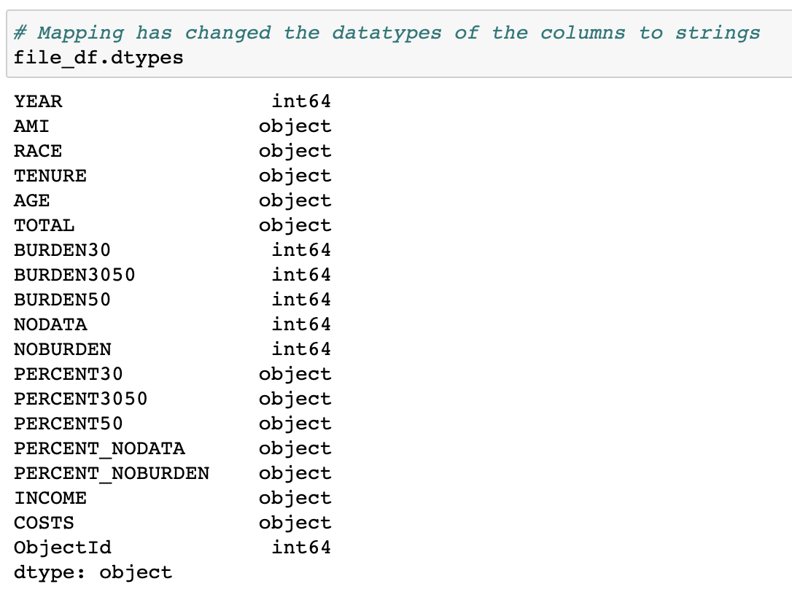

Data Source: Seattle GeoData. [Seattle Housing Cost Burden by Race](https://data-seattlecitygis.opendata.arcgis.com/datasets/SeattleCityGIS::housing-cost-burden-by-race/about)

---

### 9. Everyone Do: Crowdfunding Cleaning (30 min)

**Corresponding Activity:** [06-Evr_Crowdfunding_Cleaning](Activities/06-Evr_Crowdfunding_Cleaning/)

Continue through the slideshow, using the next slides as an accompaniment to this activity.

For the remainder of the lesson, the class will practice using Pandas by taking the dataset from their first homework, cleaning it up, and formatting it in far less time than it would take in Excel.

Open the unsolved [crowdfunding_cleaning.ipynb](Activities/06-Evr_Crowdfunding_Cleaning/Unsolved/crowdfunding_cleaning.ipynb) file within Jupyter notebook and give the class a few minutes to work on the code in each cell. Then, walk the through the [crowdfunding_cleaning_solution.ipynb](Activities/06-Evr_Crowdfunding_Cleaning/Solved/crowdfunding_cleaning_solution.ipynb) as needed to assist them in completing the activity.

Data Source: Data for this dataset was generated by edX Boot Camps LLC, and is intended for educational purposes only.

---

### 10. BREAK (15 min)

---

### 11. Instructor Do: Introduction to Bug Fixing (10 min)

**Corresponding Activity:** [07-Ins_Intro_to_Bugfixing](Activities/07-Ins_Intro_to_Bugfixing)

Continue the slideshow using the next few slides for this demonstration.

Open [intro_to_bugfixing_solution.ipynb](Activities/07-Ins_Intro_to_Bugfixing/Solved/intro_to_bugfixing_solution.ipynb) within Jupyter notebook, and also send the code out to the class. Make sure to send [veterans.csv](Activities/07-Ins_Intro_to_Bugfixing/Solved/Resources/veterans.csv) out to the class, as well.

Cover the following key points as you go:

* If we try to get the mean of the "Percentage" column, an `ValueError` is returned as captured in the following image:

    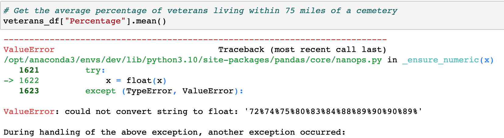

* Ask the class to resist pointing out the bug in this block of code for now. Many students are likely aware that the values within the column are strings, and it is not possible to collect the mean of a string.

* The first step in fixing a bug is to keep calm.

  * Bugs happen all the time, and they are rarely the end of the world. In fact, most bugs that programmers encounter are simple enough to solve&mdash;as long as they know how and where to look for the solution.

* The second step in bug fixing an application is to identify what the bug is and where it is located.

  * Since the class is using Jupyter notebook, finding the erroneous block of code is easy. The error will always be returned in the space following the erroneous cell.

  * Unfortunately, Pandas is not known for returning clearly understandable error text. In fact, it often returns large blocks of complex text that can easily confuse those who do not know the library's underlying code. The line following `KeyError:` is generally a good starting point.

  * For example, the text following `ValueError:` within the current code lets the programmer know that Pandas cannot convert the string values in the "Percentage" column to float:

    ```text
    ValueError: could not convert string to float: '72%74%75%80%83%84%88%89%90%90%89%'
    ```

  * If the error text isn’t entirely clear, it can be helpful to print out variables/columns to the console to uncover the bug’s location. For example, printing out the "Percentage" Series lets the programmer know that the `dtype` of this series is an object and not a float.

* The third step is to research the error online for solutions that other programmers have uncovered.

  * The key part to this step is coming up with an accurate way to describe the bug, which can take multiple attempts, but it is a skill that will develop over time.

  * Google is the programmer's best friend, as typing in a description of the bug will often bring up links to possible solutions. If not, simply alter the search a bit until a solution is discovered.

    

  * This particular problem requires the code to drop the percentages within the "Percentage" column, so the search could be more specific and add that information, as captured in the following image:

    

  * The first link takes the class to a Stack Overflow question that asks how to drop percentages and convert a column to floats. This provides a solution for the bug.

  * Feel free to copy and paste the solution, and then modify it within the Jupyter notebook, as captured in the following image. Let the class know that copying and pasting from Stack Overflow is something almost every single programmer does.

    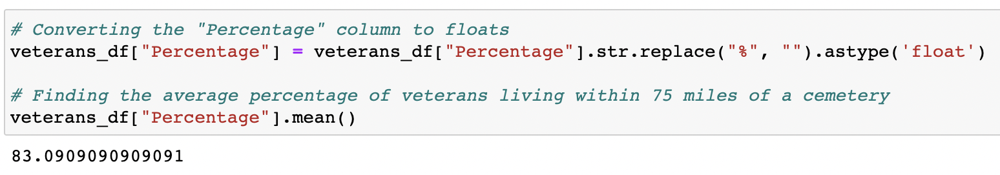

Data Source: Department of Veteran Affairs. [Percentage of Veterans Served Within 75 Miles of a State or National Cemetery.](https://catalog.data.gov/dataset/percentage-of-veterans-served-within-75-miles-of-a-state-or-national-cemetery)

---

### 12. Everyone Do: Bug Fixing Bonanza (35 min)

**Corresponding Activity:** [08-Evr_Bugfixing_Bonanza](Activities/08-Evr_Bugfixing_Bonanza/)

* Continue through the slideshow, using the next slides as an accompaniment to this activity.

* The class will now be provided with a Pandas project that contains TONS of bugs. They will take the application and fix any bugs so that it works properly. This activity will test their Pandas skills while also teaching them how to teach themselves.

* Give the students a few minutes to work on each bug in the unsolved [bugfixing_bonanza.ipynb](Activities/08-Evr_Bugfixing_Bonanza/Unsolved/bugfixing_bonanza.ipynb) file.

* Then, open [bugfixing_bonanza_solution.ipynb](Activities/08-Evr_Bugfixing_Bonanza/Solved/bugfixing_bonanza_solution.ipynb) within Jupyter notebook, and go through the solution for each bug with the class, discussing it cell by cell.

  * Bugs are a fact of life for programmers; whether they are bugs that you introduce while trying to solve a problem or bugs that you are helping colleagues fix, bug fixing is a significant component of writing and working with code. As such, it is extremely helpful to practice bug fixing as much as possible.

  * The first bug is simple. No dependencies have been declared, so the application will not be able to use Pandas.

  * The second bug is also simple. The leading `../` in the CSV path is incorrect.

  * The third bug is also simple. The CSV path is being read in, but it is not being saved to a DataFrame.

  * The fourth bug is where things start to get complex. Pandas is unable to reduce the columns in the DataFrame because the "Re-infested  Dwelling Unit Count" is not in the index because the column name contains an extra space. This column will need to be renamed as follows:

    ```python
    bugs_df = bugs_df.rename(
      columns={"Re-infested  Dwelling Unit Count": "Re-infested Dwelling Unit Count"})
    ```

  * The fifth bug is an `AttributeError:` and requires a change to the data type for the "Filing Date" column before any `dt` functions can be performed on it as follows:

    ```python
    # Extract the year from the date
    bugs_df["Filing Date"] = bugs_df["Filing Date"].astype("datetime64")
    bugs_df["Year"] = bugs_df["Filing Date"].dt.year
    bugs_df.head()
    ```

  * The sixth bug is a little tricky. When trying to convert the "Postcode" column to type an `int64`, there is an error that reads `IntCastingNaNError: Cannot convert non-finite values (NA or inf) to integer`. To fix this error we neede to drop null values as follows:

    ```python
    # Drop null values.
    bug_infestations = bug_infestations.dropna()
    bug_infestations.count()
    ```

  * For the seventh bug, when continuing code on the next line requires a "backward slash" `\`, or enclosing the calculation inside parentheses `()`. This bug can be fixed using either approach.

  * The next bug, captured in the following image, is only a warning, but it can be fixed by turning the columns into a list with additional square brackets.

    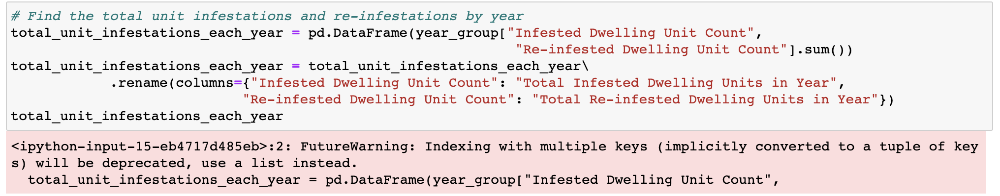

  * For the final bug, we get a `MergeError` that tells us that there are not common columns to perform the merge.

    ```text
    MergeError: No common columns to perform merge on. Merge options: left_on=None, right_on=None, left_index=False, right_index=False
    ```

  * To fix this error we have to specify the columns to be merged on. The “Borough” column must be specified in addition to `on="Year"`, as follows:

    ```python
    # Merge unit_infestations_by_year_borough and join the "Total Infested Dwelling Units in Year"
    # into the year_borough_df DataFrame
    merged_df = year_borough_df.merge(unit_infestations_by_year_borough,
                                      on=["Year", "Borough"]).join(total_unit_infestations_each_year,
                                      on="Year")
    merged_df.head()
    ```

Data Source: NYC Department of Housing Preservation and Development (HPD). [Bedbug Reporting](https://data.cityofnewyork.us/Housing-Development/Bedbug-Reporting/wz6d-d3jb)

---

© 2022 edX Boot Camps LLC. Confidential and Proprietary. All Rights Reserved.
