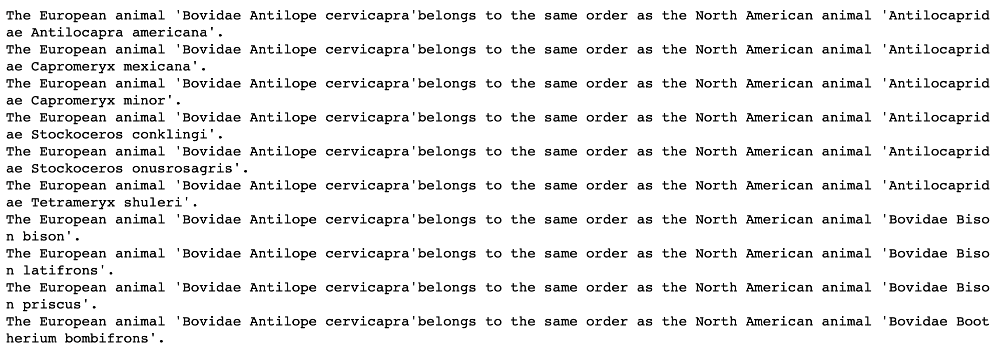
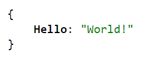
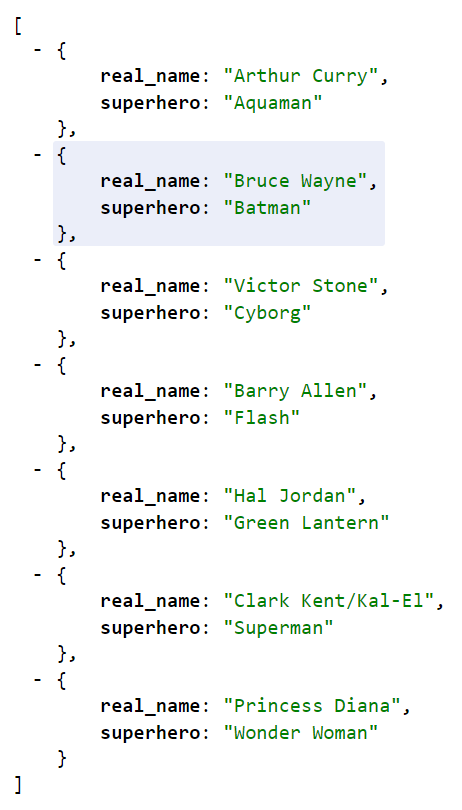

# 10.3: Introduction to Flask & Serving Data with APIs

## Overview

Today's lesson introduces the students to the fundamentals of the web and client-server architecture, including using Flask to create a database-backed server and to design and implement API endpoints.

### Class Objectives

By the end of this lesson, the students will be able to:

* Use Flask to create and run a server.

* Define endpoints using Flask's `@app.route` decorator.

* Extract query-variable path values from get requests.

* Use variable paths to execute database queries on behalf of the client.

* Return JSONified query results from API endpoints.

---

### Instructor Notes

In this lesson, we introduce the `Flask` library. This curriculum has been tested with Python 3.10, but updates to packages and variances in student machines can still cause conflicts to occur. If a student has an error that you believe to be related to Python 3.10, at your discretion you can instruct them to create a new environment using a different Python version. If you believe that an update has introduced a bug at a curriculum level, attempt to find a suitable workaround for the moment and submit a report using the Boot Camp Feedback Form.

---

### Class Slides

* The slides for this lesson can be viewed on Google Drive here: [Lesson 10.3 slides](https://docs.google.com/presentation/d/1R_EiibBwIt36proCHHBn0s9ZZD49p6rqxc0BU1J9l2Q/edit?usp=sharing).

* To add the slides to the student-facing repository, download the slides as a PDF by navigating to File, selecting "Download as," and then choosing "PDF document." Then, add the PDF file to your class repository along with other necessary files. You can view instructions for this [here](https://docs.google.com/document/d/1XM90c4s9XjwZHjdUlwEMcv2iXcO_yRGx5p2iLZ3BGNI/edit?usp=sharing).

* **Note:** Editing access is not available for this document. If you wish to modify the slides, create a copy by navigating to File and selecting "Make a copy...".

---

### Time Tracker

| Start Time | Number | Activity                                           | Duration |
| ---------- | ------ | -------------------------------------------------- | -------- |
| 6:30 PM    | 1      | Instructor Do: Joins                               | 0:10     |
| 6:40 PM    | 2      | Instructor Do: Dates                               | 0:10     |
| 6:50 PM    | 3      | Students Do: Dow Dates                             | 0:15     |
| 7:05 PM    | 4      | Review: Dow Dates                                  | 0:05     |
| 7:10 PM    | 5      | Instructor Do: Introduction to Flask               | 0:15     |
| 7:25 PM    | 6      | Students Do: Hello, Web                            | 0:10     |
| 7:35 PM    | 7      | Review: Hello, Web                                 | 0:10     |
| 7:45 PM    | 8      | Instructor Do: JSON APIs with jsonify              | 0:10     |
| 7:55 PM    | 9      | Students Do: Justice League                        | 0:15     |
| 8:10 PM    | 10     | Review: Justice League                             | 0:10     |
| 8:20 PM    | 11     | BREAK                                              | 0:15     |
| 8:35 PM    | 12     | Instructor Do: Routes with Variable Paths          | 0:10     |
| 8:45 PM    | 13     | Students Do: Routes with Variable Rules            | 0:20     |
| 9:05 PM    | 14     | Review: Routes with Variable Rules                 | 0:10     |
| 9:15 PM    | 15     | Instructor Do: Flask with ORM                      | 0:15     |
| 9:30 PM    |        | END                                                |          |

---

### 1. Instructor Do: Joins (10 min)

**Corresponding Activity:** [01-Ins_Joins](Activities/01-Ins_Joins/)

* Open the slides, and use the slides to welcome the class and begin the first activity. Be sure to cover the following:

* Welcome the class, and go over the class objectives for today:

  * Create and run a Flask server.

  * Create static query endpoints in Flask.

  * Execute dynamic database queries with Flask.

  * Return API query results in JSON.

* Explain that in this first activity, you will demonstrate how to perform joins in SQLAlchemy.

* Remind the students that SQLAlchemy can use pure SQL to manipulate SQL databases, or a more Pythonic object-based approach can be used.

  * When we use Python classes and objects with SQLAlchemy, SQL query joins behave similarly to Pandas DataFrame joins.

* Point out that to perform a join on tables using SQLAlchemy, we must first identify the structure and data contained within the SQL tables.

* Explain that once we identify what tables to join, what columns to keep, and what columns to join on, we can use the `.filter()` method to obtain the merged table results.

* Open [joins_solution.ipynb](Activities/01-Ins_Joins/Solved/joins_solution.ipynb) within Jupyter notebook, and first review how to use a SQLAlchemy filter, which is the equivalent of a SQL `WHERE` statement, as captured in the following code and output:

  ```python
  # Filter North American mammals whose genus is "Antilocapra"
  # Query, loop over and print out animals.
  mammals = session.query(NA).filter(NA.genus == 'Antilocapra').all()
  for mammal in mammals:
      print(f"Family: {mammal.family}, Genus: {mammal.genus}")
  ```

  ```text
  Family: Antilocapridae, Genus: Antilocapra
  ```

  * The `NA` (North American mammal) table is queried and filtered for rows where the `genus` is `Antilocapra`.

* Proceeding to joins, we first use `inspect` to retrieve the names of the tables in the database, as in the following code:

  ```python
  # Get the table names using `inspect()`.
  inspector = inspect(engine)
  inspector.get_table_names()
  ```

  * This returns the following table names:

    ```text
    ['af', 'aus', 'ea', 'insular', 'na', 'oceanic', 'sa']
    ```

* Likewise, we can `inspect` to retrieve the names of the columns in a table, as in the following code:

  ```python
  # Get a list of column names and types
  columns = inspector.get_columns('ea')
  for c in columns:
      print(c['name'], c["type"])
  ```

  * This returns the following table names:

    ```text
    id INTEGER
    continent TEXT
    status TEXT
    order TEXT
    family TEXT
    genus TEXT
    species TEXT
    log_mass FLOAT
    combined_mass FLOAT
    reference TEXT
    ```


* The query in the following code will select all `order` columns from both `ea` (Europe) and `na` (North America) tables:

  ```python
  # Join all the order names for the EA and NA classes.
  session.query(EA.order, NA.order).limit(200).all()
  ```

* Explain that this performs a cross join, combining each row in the first table with each row of the second table. However, this query gives a warning and should be filtered as the next two queries will show.

* First we filter on the "order" and return specific column from each table as the code shows:

  ```python
  # Filter the the join query.
  same_order = session.query(EA, NA).filter(EA.order == NA.order).limit(10).all()

  for record in same_order:
      (ea, na) = record
      print(ea.order, ea.family, ea.genus, ea.species)
      print()
      print(na.order, na.family, na.genus, na.species)
  ```

* We can also create a list of columns to query as the following code shows:

  ```python
  # Return all animals from EA and NA belonging to the same order.
  # This JOINs the data in the two tables together into a single dataset (here in the form of a tuple).
  sel = [EA.family, EA.genus, EA.species, NA.family, NA.genus, NA.species]
  same_order = session.query(*sel).filter(EA.order == NA.order).limit(10).all()

  for record in same_order:
      (ea_fam, ea_gen, ea_spec, na_fam, na_gen, na_spec) = record
      print(
          f"The European animal '{ea_fam} {ea_gen} {ea_spec}'"
          f"belongs to the same order as the North American animal '{na_fam} {na_gen} {na_spec}'.")
  ```

  * The `sel` variable is assigned to a list that holds the columns queried from both tables.

  * Then, the results are filtered by finding the rows in each table where the value of the `order` is the same in each row.

  * Finally, the results are packed into a tuple and printed, as in the following image:

    


* Data Source: Felisa A. Smith, S. Kathleen Lyons, S. K. Morgan Ernest, Kate E. Jones, Dawn M. Kaufman, Tamar Dayan, Pablo A. Marquet, James H. Brown, and John P. Haskell. 2003. Body mass of late Quaternary mammals. Ecology 84:3403. [https://esapubs.org/archive/ecol/E084/094/#data](https://esapubs.org/archive/ecol/E084/094/#data)

---

### 2. Instructor Do: Dates (10 min)

**Corresponding Activity:** [01-Ins_Dates](Activities/02-Ins_Dates/)

* Use the slides to introduce the next activity. Be sure to cover the following points:

  * This activity will be a demonstration of how to work with dates in SQLAlchemy.

  * In programming, times and dates have traditionally been trickier to manipulate than integers or decimals.

    * For example, to add and subtract dates might involve doing so in seconds and then converting the results to days, months, weeks, or years.

    * Python offers libraries that make handling dates easier.

  * When it comes to real-world datasets, dates and times may be stored as `datetype` objects, as strings, or even as integers.

    * Therefore, it is important to use tools such as Python's `datetime` library to parse, convert, compare, and filter by dates in a database.

* Open [dates_solution.ipynb](Activities/02-Ins_Dates/Solved/dates_solution.ipynb) within Jupyter notebook, and review how to query dates using SQLAlchemy:

* The database used in this activity deals with stock prices from the Dow Jones index over a period of time.

* After setting up and reflecting the SQL database into Python objects with SQLAlchemy, show how to query the first date in the table, as in the following image:

  

  * To show the latest date, order the dates in descending order and query the first result.

* Explain that it is also possible to filter for dates greater than (or less than) a given date, as in the following image:

  

* Next, go over the Python `datetime` library, as captured in the following image:

  

  * `date.date` or `date.datetime` can be used to retrieve and format dates and date times in ISO format.

* Difference in time can also be calculated with `timedelta`:

  

* Demonstrate that we can query a date by using the `datetime` library and then use the results in a SQLAlchemy filter:

  

* Finally, demonstrate how to extract a specific parameter, such as a date, week, or hour, from a `datetime` object:

  

  * In the preceding code and image, only the date (20) is parsed out.

* Optionally, show the final example, which demonstrates SQLAlchemy's `func.strftime` method:

  


* Data Source: Brown, Michael. (2013). Weekly Dow Jones Index Data. 10.13140/2.1.2729.4409.

---

### 3. Students Do: Dow Dates (15 min)

**Corresponding Activity:** [03-Stu_Dow_Dates](Activities/03-Stu_Dow_Dates/)

* You may use the slides to accompany this activity.

* In this activity, the students will practice working with dates, both in SQLAlchemy and with the `datetime` library. The instructions can also be found in the notebook file as comments.

* Data Source: Brown, Michael. (2013). Weekly Dow Jones Index Data. 10.13140/2.1.2729.4409.

---

### 4. Review: Dow Dates (5 min)

Open [dow_dates_solution.ipynb](Activities/03-Stu_Dow_Dates/Solved/dow_dates_solution.ipynb) within Jupyter notebook, and review how to query dates using SQLAlchemy:

* The first task was to obtain the average price of each stock during the month of May.

* SQLAlchemy's `func.avg` method is used to obtain the average values of opening, high, low, and closing prices, as in the following code:

  ```python
  # Query for the stock and average prices (open, high, low, close)
  # for all stock in the month of May
  # Sort the result by stock name
  sel = [Dow.stock,
       func.avg(Dow.open_price),
       func.avg(Dow.high_price),
       func.avg(Dow.low_price),
       func.avg(Dow.close_price)]
  may_averages = session.query(*sel).\
      filter(func.strftime("%m", Dow.date) == "05").\
      group_by(Dow.stock).\
      order_by(Dow.stock).all()
  may_averages
  ```

  * These averages are queried and then filtered for results from May.

  * `func.strftime` is used to filter for results from May.

  * `%m` specifies the month.

* May’s average prices are pulled into a Pandas DataFrame and then plotted with Matplotlib, as in the following code and image:

  ```python
  # Plot the Results in a Matplotlib bar chart
  df = pd.DataFrame(may_averages, columns=['stock', 'open_avg', 'high_avg', 'low_avg', 'close_avg'])
  df.set_index('stock', inplace=True)
  df.plot.bar()
  plt.tight_layout()
  plt.show()
  ```

    

* In the bonus, the students were asked to examine IBM's stock prices after May 2011 and subtract its low price from its high price. They were also asked to use the `datetime` library, as in the following code:

  ```python
  # Design a query to calculate the PTP for stock `IBM` after May, 2011
  import datetime as dt

  date = dt.datetime(2011, 5, 31)

  results = session.query(Dow.high_price - Dow.low_price,
                          Dow.date).\
                    filter(Dow.date > date).filter(Dow.stock == 'IBM').all()

  # List comprehension solution
  ptp_rows = [{"Date": result[1], "PTP": result[0]} for result in results]
  ptp_rows
  ```

  * The `datetime` library is used to assign a date to a variable.

  * It is then plugged into the SQLAlchemy query to filter out dates that come after May 31, 2011.

* Next, go over the box plot, as captured in the following code and image:

  ```python
  # Load the list comprehension rows into a dataframe, set the index to the date, and plot the PTPs
  pd.DataFrame(ptp_rows).set_index("Date").boxplot(patch_artist=True)
  plt.title("IBM PTPs")
  plt.show()
  ```

    


---

### 5. Instructor Do: Introduction to Flask (15 min)

**Corresponding Activity:** [04-Ins_First_Steps_with_Flask](Activities/04-Ins_First_Steps_with_Flask/)

* Use the slides to introduce the next activity. Be sure to cover the following points:

* Remind the students that the internet is built on a model of **clients** requesting data from **servers**.

* A **client** asks for information. For example, when a person uses an API to fetch data, we tend to consider the person the client.

  * Note that, strictly speaking, this isn't accurate: A program makes a request on behalf of the person.

  * Explain that a browser is an example of a program that makes requests on behalf of a user.

* Point out that the same holds true for servers: A **server** is simply a process that runs on a remote machine. It listens for, and knows how to respond to, incoming requests.

  * Emphasize that a server is, essentially, just a program.

* Explain that when we create an API for others to use, the code that they write acts as a client to our API server.

  * Point out that we have no control over the code that our consumers write.

  * Explain that this means that, as API developers, we do not write client code. This means we will focus on writing the code that runs the server.

  * Remind the students that this is the code responsible for retrieving and returning the data requested by users.

* Explain that [Flask](http://flask.pocoo.org/) is the tool that we'll use to implement our server.

  * Inform the students that Flask is an extremely intuitive library that makes it easy to develop APIs for distributing our data.

* Remind the students that servers are programs that listen for requests to particular URLS, or **endpoints**.

  * Explain that Flask makes creating and starting a server, and defining endpoints, easy: It takes fewer than 10 lines of code to define a functional index route!

* Open the [app_solution.py](Activities/04-Ins_First_Steps_with_Flask/Solved/app_solution.py) file in an IDE, and explain the following:

  ```python
  # 1. Import Flask
  from flask import Flask

  # 2. Create an app, being sure to pass __name__
  app = Flask(__name__)

  # 3. Define what to do when a user hits the index route
  @app.route("/")
  def home():
      print("Server received request for 'Home' page...")
      return "Welcome to my 'Home' page!"

  # 4. Define what to do when a user hits the /about route
  @app.route("/about")
  def about():
      print("Server received request for 'About' page...")
      return "Welcome to my 'About' page!"

  if __name__ == "__main__":
    app.run(debug=True)
  ```

* Explain that to create a server, we import `Flask` (`#1`) and use it as a factory to create an `app` (`#2`).

  * Explain that for our purposes, passing `__name__` to `Flask` is mandatory.

* Explain how we use `@app.route` to associate an endpoint or URL (`/`, or `/about`) with the result of a function call (of `home` or `about`, respectively).

* Take a moment to hit each route in the browser again.

  * Point out that, in the terminal, we see the results of the `print` message, but we do not see a trace of the string we `return` to the client.

  * Point out that, in the browser, we see the string that the request handler returns, but we do not see a trace of the call to `print`.

  * Use this to illustrate and emphasize the relationship between the client, which receives a request handler's return value, and the server, where the functions associated with the response to a request are actually executed.

* Finally, remind the students about using `if __name__ == "__main__"` to define "main" behavior.

  * Explain that `app.run` is all we need to do to start the development server.

  * Explain that passing `debug=True` makes development much easier, but in production, best practices demand that `debug` must always be false.

* Answer any questions before moving on.

---

### 6. Students Do: Hello, Web (10 min)

**Corresponding Activity:** [05-Stu_Hello_Web](Activities/05-Stu_Hello_Web/)

* You may use the slides to accompany this activity.

* Take a moment to run [app_solution.py](Activities/05-Stu_Hello_Web/Solved/app_solution.py), and open it in the browser at [localhost:5000](http:127.0.0.1:5000). Demonstrate each of the following endpoints:

  * `/`

  * `/about`

  * `/contact`

* Point out that each of these endpoints returns a string.

* Address any questions before allowing the students to work.

---

### 7. Review: Hello, Web (10 min)

* Remind the students that the objective of this activity was to create a server with three static endpoints, each of which returns a simple string response.

* Open [app_solution.py](Activities/05-Stu_Hello_Web/Solved/app_solution.py), and point out each of the steps required to create a server and define endpoints with Flask:

  ```python
  # 1. Import Flask
  from flask import Flask

  # 2. Create an app
  app = Flask(__name__)

  # 3. Define static routes
  @app.route("/")
  def index():
    return "Hello, world!"

  @app.route("/about")
  def about():
    name = "Peleke"
    location = "Tien Shan"

    return f"My name is {name}, and I live in {location}."

  @app.route("/contact")
  def contact():
    email = "peleke@example.com"

    return (
      f"Questions? Comments? Complaints?<br>"
      f"Send an email to {email}."
    )

  # 4. Define main behavior
  if __name__ == "__main__":
    app.run(debug=True)
  ```

* Explain the following steps:

  1. Import Flask.

  2. Use Flask to create an `app`.

  3. Use the `@app.route` **decorator** to define a route.

     * `@app.route` is a function that takes the route's URL as its argument.

     * We then define a function that describes how the server should respond to requests to the corresponding endpoint.

     * We can use whatever names we want for these functions, which are often called **request handlers**.

  4. Fourth and finally, we define the behavior for when we start the server by running the file from the command line with `python app.py`. In this case, we run our Flask app.

* Answer any questions before moving on.

---

### 8. Instructor Do: JSON APIs with jsonify (10 min)

**Corresponding Activity:** [06-Ins_Jsonify](Activities/06-Ins_Jsonify/)

* Use the slides to introduce this activity. Be sure to cover the following points:

  * All of the routes that we've written so far have returned _string_ responses.

  * The APIs we've dealt with do _not_ return raw text; rather, they return JSON data.

  * Fortunately, Python dictionaries map naturally to JSON.

    * Flask has a built-in method to automatically convert a dictionary into a properly formatted JSON response: `jsonify`.

    * Explain that although `jsonify` is not necessary as of Flask 1.1.0, it is still a good practice to use `jsonify` to ensure that the response is always treated appropriately.

* Remind the students that routes must return HTTP responses.

  * This means we can't simply return the dictionary itself.

  * We can use `jsonify` to create an HTTP response with the dictionary data that we want to send back to the client.

* Open [app_solution.py](Activities/06-Ins_Jsonify/Solved/app_solution.py), and go over the following code and talking points:

  ```python
  from flask import Flask, jsonify

  app = Flask(__name__)

  hello_dict = {"Hello": "World!"}

  @app.route("/normal")
  def normal():
      return hello_dict

  @app.route("/jsonified")
  def jsonified():
      return jsonify(hello_dict)

  if __name__ == "__main__":
      app.run(debug=True)
  ```

* First, we import `jsonify` in addition to Flask.

* Note that the `/normal` route simply returns `hello_dict`, with no call to `jsonify`; however, Flask converts the dictionary to json for us.

* Note that we used `return jsonify(<dictionary_name>)` to ensure that we send a JSON response.

* Run `app.py`, and navigate to `localhost:5000/normal` to demonstrate how Flask automatically jsonified the dictionary.

* Navigate to `/jsonified`, and point out the working response when calling `jsonify`, as captured in the following image:

  

* Answer any questions before moving on.

---

### 9. Students Do: Justice League (15 min)

**Corresponding Activity:** [07-Stu_Justice_League_jsonify](Activities/07-Stu_Justice_League_jsonify/)

* You may use the slides to accompany this activity.

* Explain that the task for this activity is to create a server that is configured to send welcome text at its index endpoint and JSON data at its `api/v1.0/justice-league` endpoint.

* Run [app_solution.py](Activities/07-Stu_Justice_League_jsonify/Solved/app_solution.py), and navigate to `localhost:5000/` in your browser to demonstrate the index route, captured in the following image:

  

* Navigate to `localhost:5000/api/v1.0/justice-league` in your browser to demonstrate the API route, as captured in the following image:

  

* Answer any questions, and then give the class time to work.


---

### 10. Review: Justice League (10 min)

* Remind the students that the goal for this activity was to allow users to retrieve a list of JSON objects describing Justice League characters.

* Open [app_solution.py](Activities/07-Stu_Justice_League_jsonify/Solved/app_solution.py), and explain the following points:

* Point out that we've defined a list of character dictionaries, called `justice_league_members`, in the beginning of the file.

  * Explain that to implement the `/api/v1.0/justice-league` route, we simply define a route that returns `jsonify(justice_league_members)`, as in the following code:

  ```python
  @app.route("/api/v1.0/justice-league")
  def justice_league():
      """Return the justice league data as json"""

      return jsonify(justice_league_members)
  ```

* Explain that the index route simply sends a string response.

* We are using `jsonify` specifically because APIs should return JSON, and we want to ensure our code turns our dictionary into a JSON response.

* Our endpoint starts with `/api` to indicate to consumers that the response will contain data.

* Explain that, by convention, `/api` routes should always return data (JSON in this case).

  * (Brief "pulse check") Ask a student to explain why we would want to use `jsonify` in our `/api/v1.0/justice-league` route.

* Point out that we've defined a list called `justice_league_members`.

* Explain that this data will be stored in memory when we run our server.

* This list serves as a "database" of sorts; it does, after all, contain our application's data.

* Explain that "real" applications typically run against more data than can be loaded into memory. That is where a _database_ comes into play.

* Ask the students if they have an idea of how you can hook up this application to a database.

* Explain that if we replace the code where we define `justice_league_members` with code to connect to a SQLAlchemy database, we can turn this server into a truly database-backed API.

* Explain that we'll proceed in two steps:

  1. Use variable paths to collect user input.

  2. Connect the application to a database.

* Answer any questions before moving on.

---

### 11. BREAK (15 min)

---

### 12. Instructor Do: Routes with Variable Paths (10 min)

**Corresponding Activity:** [08-Ins_Variable_Rule](Activities/08-Ins_Variable_Rule/)

* Use the slides to introduce this activity. Be sure to cover the following points:

* Explain that our current API is only capable of returning the entire Justice League dataset. It would be better if users could specify a particular character of interest.

* Explain that, ideally, consumers would be able to specify a character of interest in the URL, they could expect either of the following outcomes:

  * A JSON response with the character data if it's in the dataset; or

  * A JSON response with error information, indicating that the server couldn't find the character that the user requested.

* Run [app_solution.py](Activities/08-Ins_Variable_Rule/Solved/app_solution.py), and navigate to [localhost:5000](http:127.0.0.1/). The root path lists the available routes. Visit each route, and contrast the results:

  * [/api/v1.0/justice-league](http:127.0.0.1:5000/api/v1.0/justice-league)

  * [/api/v1.0/justice-league/Arthur%20Curry](http://127.0.0.1:5000/api/v1.0/justice-league/Arthur%20Curry)

* The response at the second endpoint is just the data for Aquaman, without the rest of the data in `justice_league_members`.

* Explain that `%20` is how we represent the space character within a URL.

* Open [app_solution.py](Activities/08-Ins_Variable_Rule/Solved/app_solution.py), and point out that we've added a route, as in the following code:

```python
@app.route("/api/v1.0/justice-league/<real_name>")
def justice_league_character(real_name):
    """Fetch the Justice League character whose real_name matches
       the path variable supplied by the user, or a 404 if not."""

    canonicalized = real_name.replace(" ", "").lower()
    for character in justice_league_members:
        search_term = character["real_name"].replace(" ", "").lower()

        if search_term == canonicalized:
            return jsonify(character)

    return jsonify({"error": f"Character with real_name {real_name} not found."}), 404
```

---

### 13. Students Do: Routes with Variable Rules (20 min)

**Corresponding Activity:** [09-Stu_Variable_Rule](Activities/09-Stu_Variable_Rule/)

* You may use the slides to accompany this activity.

* Run [app_solution.py](Activities/09-Stu_Variable_Rule/Solved/app_solution.py), and demonstrate its `/api/v1.0/justice-league/superhero/<superhero>` endpoint by visiting [localhost:5000/api/v1.0/justice-league/superhero/superman](http://127.0.0.1:5000/api/v1.0/justice-league/superman) (**but try to keep the URL hidden**).

* Point out that this route is functionally identical to the `<real_name>` route from before, but it allows users to specify the desired value of the character's `superhero` key instead.

* Answer any questions before moving on.

---

### 14. Review: Routes with Variable Rules (10 min)

* Open [app_solution.py](Activities/09-Stu_Variable_Rule/Solved/app_solution.py).

* Note to the students that the functionality for the new `<superhero>` route closely mirrors that of the `<real_name>` route from the instructor demonstration.

* Point out that the new route is identical to the `<real_name>` route; the only difference is that we substitute `<real_name>` with `<superhero>`, and we add `superhero` before defining the parameter to capture.

  * Explain that we must extend the URL, or else the `<real_name>` and `<superhero>` routes will overlap.

* Explain that as an alternative to defining those two specific routes, we could define a route that takes two variable rules, `<key>` and `<value>`, as in the following code:

```python
@app.route("/api/v1.0/justice-league/<key>/<value>")
def justice_league_arbitrary_key(key, value):
    """Fetch the Justice League character whose <key> attribute has
       the value <value>."""

    for character in justice_league_members:
        if character[key] == value:
            return jsonify(character)

    return jsonify({"error": f"Character with key '{key}' with value '{value}' not found."}), 404
```

* Point out that this generalizes the pattern evident in the preceding endpoints by abstracting the hard-coded values, `real_name` and `superhero`, from the URL.

* Optionally, spend a few minutes discussing the advantages and disadvantages of each approach.

* Answer any questions before moving on.

---

### 15. Instructor Do: Flask with ORM (15 min)

**Corresponding Activity:** [10-Ins_Flask_with_ORM](Activities/10-Ins_Flask_with_ORM/)

* Use the slides to introduce this activity. Be sure to cover the following points:

  * Remind the students that any useful API must make queries against datasets much too large to load into memory.

  * Explain that we'll next see how to perform ORM queries within their Flask routes.

* Start by running the [app_solution.py](Activities/10-Ins_Flask_with_ORM/Solved/app_solution.py), and open the app in the browser [here](http:127.0.0.1:5000/). The root path will list the available routes. Visit each route, and show the results:

  * [/api/v1.0/names](http:127.0.0.1:5000/api/v1.0/names)

  * [/api/v1.0/passengers](http://127.0.0.1:5000/api/v1.0/passengers)

* Next, open the file [app_solution.py](Activities/10-Ins_Flask_with_ORM/Solved/app_solution.py), and go through the code.

* Explain that we start by initializing our database connection and reflecting our tables by using `automap_base`.

* Show that our root route `/` simply shows the available API routes for our application.

* Move on to the route `/api/v1.0/names`, and show how simple queries can be performed in the route function. This query will get executed each time that we visit the route.

* Explain that we use `list` and `np.ravel` to unpack the list of tuples into a regular list of names. Feel free to replace `jsonify(all_names)` with `jsonify(results)` to show what this looks like before converting to a list.

* Next, show the route `/api/v1.0/passengers`, and explain that here we are extracting the results into a list of dictionaries containing the `name`, `age`, and `sex` of each passenger.

* Finally, explain that we can return the JSON representation for this list of dictionary data using `jsonify`.

* Send out [11-Stu_Chinook_Database_Analysis](Activities/11-Stu_Chinook_Database_Analysis/) folder with the student activity and solution to the students so they can practice what they have learned.

* Answer any questions before moving on.

---

© 2022 edX Boot Camps LLC. Confidential and Proprietary. All Rights Reserved.
